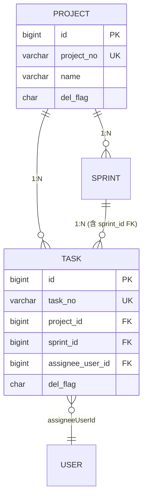

# db-design — 数据库设计 skill v0.1

**tech-lead agent 的子工具**, 主走 §2.3 数据库设计职责。

边界:
- tech-lead 出 ER + 字段表 + 索引策略 + 并发选型 (设计层)
- db-modeler 落 `plm-backend/sql/business-<entity>.sql` DDL (实施层)

---

## 1. 何时调用

- 用户说 "数据库设计 / ER 图 / 字段表"
- tech-lead agent §2.3 触发
- 新模块 Phase 02 §B.2 必产出物
- 现有模块加字段 / 改索引 / 调并发

---

## 2. 必读 (per 0040 §3.1 + 0041 §3.1)

1. `01-立项/<模块>-PRD.md` § 字段表 (由 pm-prd-writer 产)
2. `PRD-MAPPING.md §<模块>` 字段对照表
3. `prd和原型/.../<module>.html` 原型字段
4. `plm-backend/sql/business-<其他>.sql` 类似模块 DDL (作模板)
5. 现存代码 grep (per 0041): `plm-backend/plm-<其他>/.../*.java`

---

## 3. 7 维设计 (Phase 02 §B.2 全覆盖)

### 3.1 ER 图 (Mermaid)



### 3.2 字段表 (PRD 字段 → SQL 列)

```sql
CREATE TABLE tb_<entity> (
  id              BIGINT       AUTO_INCREMENT PRIMARY KEY  COMMENT '主键',
  <entity>_no     VARCHAR(20)  NOT NULL UNIQUE             COMMENT '业务编号 <PREFIX>-YYYY-NNNN',
  title           VARCHAR(200) NOT NULL                    COMMENT '标题',
  status          VARCHAR(50)  NOT NULL DEFAULT 'draft'    COMMENT '状态机 enum, 字典 biz_<entity>_status',
  
  -- FK 字段 (snake_case, per rules.md §M.7 跨模块一致性)
  project_id      BIGINT       NOT NULL                    COMMENT '关联项目, FK',
  assignee_user_id BIGINT      NULL                        COMMENT '负责人, FK',
  
  -- 服务端计算字段 (per rules.md §M.3 不接受前端写入)
  quality_gate_passed CHAR(1)  NULL                        COMMENT 'AI 计算, Y/N',
  
  -- 软删 (per rules.md §M.7)
  del_flag        CHAR(1)      NOT NULL DEFAULT '0'        COMMENT '0 正常 / 2 删除',
  
  -- 标准审计字段 (per RuoYi 框架)
  create_by       VARCHAR(64)  DEFAULT ''                  COMMENT '创建者',
  create_time     DATETIME     DEFAULT CURRENT_TIMESTAMP   COMMENT '创建时间',
  update_by       VARCHAR(64)  DEFAULT ''                  COMMENT '更新者',
  update_time     DATETIME     DEFAULT CURRENT_TIMESTAMP ON UPDATE CURRENT_TIMESTAMP COMMENT '更新时间',
  remark          VARCHAR(500) DEFAULT NULL                COMMENT '备注'
) ENGINE=InnoDB DEFAULT CHARSET=utf8mb4 COLLATE=utf8mb4_0900_ai_ci COMMENT='<实体>';
```

### 3.3 主键策略 (per proposal 0017 bundle)

- Project (根实体): `id BIGINT PK`, 业务键 `project_no UNIQUE`
- 子实体: `id BIGINT PK`, FK 用 `<table>_id` (e.g. `project_id`, `sprint_id`)
- ADR 化跨模块一致 (per rules.md §M.7)

### 3.4 索引设计

```sql
-- 主键自带索引
-- 业务唯一键
UNIQUE KEY uk_<entity>_no (<entity>_no),
-- FK 查询索引
KEY idx_<entity>_project_id (project_id),
KEY idx_<entity>_assignee (assignee_user_id),
-- 状态机查询
KEY idx_<entity>_status (status),
-- 软删过滤 (大表必加)
KEY idx_<entity>_del_flag (del_flag)
```

### 3.5 并发控制 (per proposal 0021 bundle, Phase 02 必决)

3 种选项, AskUserQuestion 让用户选:

| 方案 | 适用 | 字段 | 锁开销 |
|---|---|---|---|
| **@Version 乐观锁** | 读多写少 / 冲突低 | 加 `version INT DEFAULT 0` | 低 (重试) |
| **悲观锁 (FOR UPDATE)** | 写冲突高 / 强一致 | 无额外字段, Service 加 `SELECT FOR UPDATE` | 高 (阻塞) |
| **Redis 分布式锁** | 跨进程 / 高并发 | 无 DB 字段, Service 调 Redisson | 中 (网络) |

不选 → Phase 03 必遇问题, 拖延决策 = 反模式 (per proposal 0021)。

### 3.6 字典 (per rules.md §A.A 业务字典)

ENUM 字段 (status / type / severity / environment) 必走字典:
- type 前缀 `biz_<entity>_<field>` (不混 sys_*)
- INSERT INTO sys_dict_type + sys_dict_data
- service 入口校验白名单, 不在 → 抛 604

### 3.7 软删 (per rules.md §M.7)

- 字段 `del_flag CHAR(1) DEFAULT '0'`
- 0 = 正常, 2 = 已删
- 所有查询加 `WHERE del_flag='0'` (Mapper.xml 默认条件)
- 删除操作改 UPDATE: `UPDATE ... SET del_flag='2' WHERE id=?`

---

## 4. 输出

`02-设计/<模块>-数据库设计.md` 含 7 段:
1. ER 图 (Mermaid)
2. 字段表 (SQL CREATE TABLE 完整)
3. 主键策略说明
4. 索引设计
5. 并发控制 (选定方案 + 理由)
6. 字典清单
7. 软删策略

---

## 5. 衔接

| 上游 | db-design | 下游 |
|---|---|---|
| pm-prd-writer 字段表 | → ER + SQL DDL | → db-modeler (落 plm-backend/sql/business-*.sql) |
| 现有 SQL grep (per 0041) | → 兼容性评估 | → backend-coder (Domain + Mapper) |
| 并发场景 (PRD §3) | → 选 @Version / 悲观 / 分布式 | → adr-writer (写 ADR 记决策) |

---

## 6. 反模式

- ❌ 凭记忆写字段 (per 0040 §3.1 必读 PRD-MAPPING.md)
- ❌ 主键命名不一致 (Project=id / 子=table_id; 必跨模块一致)
- ❌ 并发选型留 "Phase 03 再说" (per proposal 0021 Phase 02 必决)
- ❌ ENUM 字段不走字典 (硬编码扩展难)
- ❌ 软删字段缺 (per rules.md §M.7)
- ❌ 索引漏 del_flag (大表查询慢)
- ❌ charset 不写 utf8mb4_0900_ai_ci (per gotchas 编码事故)

---

## 7. 历史

| v0.1 | 2026-05-19 | 首版; tech-lead 配套 4 skill 之二 |
