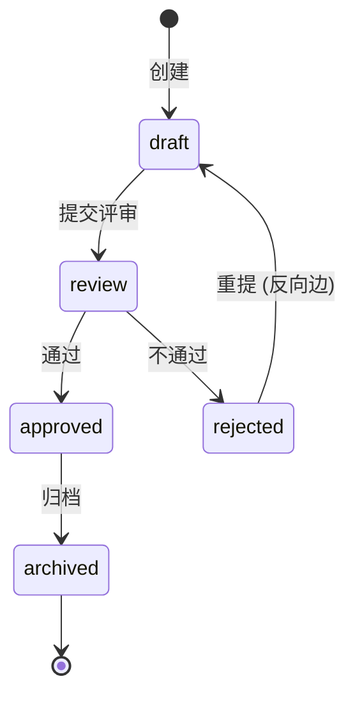

# state-machine-designer — 状态机设计 skill v0.1

**tech-lead agent 的子工具**, 主走 §2.5 状态机定义职责。

---

## 1. 何时调用

- 用户说 "状态机设计 / state machine / 状态转换 / 反向边"
- tech-lead agent §2.5 触发
- 新模块状态机首次设计
- 现有状态机加状态 / 调反向边

---

## 2. 必读 (per rules.md §M.4)

1. PRD §3.2 该模块的状态术语 (草稿/评审/确认/...)
2. 原型 HTML 状态徽章 CSS 类:
   - `.bg` = 已确认 (绿)
   - `.bam` = 评审中 (黄)
   - `.bgr` = 草稿 (灰)
   - `.bd` = 失败 / 拒绝 (红)
3. PRD-MAPPING.md §3 状态机汇总 (类似模块)

**禁止凭"参考其他模块顺便补全状态"** — 每个状态必须能在 PRD 或原型里指出原文 (per rules.md §M.4)。

---

## 3. 5 步流程

### Step 1: 状态列表

从原型徽章逐个抽:

| 状态 | 中文 | 原型徽章 CSS | PRD § 提到? |
|---|---|---|---|
| draft | 草稿 | .bgr | §3.2 ✓ |
| review | 评审中 | .bam | §3.2 ✓ |
| approved | 已确认 | .bg | §3.2 ✓ |
| rejected | 拒绝 | .bd | §3.2 ✓ |
| archived | 已归档 | (无 badge, 但 PRD §3.4 提) | §3.4 ✓ |

每行必填"PRD § 提到?" 列, 不能空 (per rules.md §M.4)。

### Step 2: 转换矩阵 (M×M)

逐对状态判合法/非法:

```
        ↓ to     draft  review  approved  rejected  archived
from ↓
  draft           -      ✓        -         ✓         -
  review          -      -        ✓         ✓         -
  approved        -      -        -         -         ✓
  rejected        ✓      -        -         -         -    ← 反向边
  archived        -      -        -         -         -
```

- ✓ = 合法 (Service 允许)
- `-` = 非法 (Service 抛 601)
- 终态 (archived) 行全 `-`

### Step 3: 反向边显式 (per proposal 0019)

反向边 (e.g. rejected → draft) **必显式标注 + UI 提示**:

| 反向边 | 业务语义 | UI 提示 |
|---|---|---|
| rejected → draft | "拒绝后重新编辑" | 列表显示 "重提" 按钮 |
| approved → draft | (一般禁) | — |

不标 → Phase 03 时开发不知道反向边 → 流程错乱 (proposal 0019 已 bundle 升 0016)。

### Step 4: 进入态必填字段 (per proposal 0019)

某些状态进入时必填 (e.g. resolved 必填 resolution):

| 进入态 | 必填字段 | 错误码 |
|---|---|---|
| resolved | resolution (VARCHAR(500)) | 705 |
| rejected | rejection_reason | 705 |
| approved | reviewer_user_id | 705 (per ADR-0007 文档类型同样) |

Service 入口校验: 转换到该状态时缺字段 → 抛 705。

### Step 5: 错误码登记

- 601 状态机违规 (per rules.md §M.5)
- 705 进入态必填字段缺

登记到 PRD-MAPPING.md §4 (per [proposal 0100](../../../99-跨阶段/proposals/0100-fk-validation-via-service-checkexists.md))。

---

## 4. 输出

### 4.1 `02-设计/<模块>-状态机.md`

含:
1. 状态列表 (含原型徽章 CSS 类 + PRD § 引用)
2. 转换矩阵 (M×M)
3. 反向边显式 (含 UI 提示)
4. 进入态必填字段表
5. 错误码 (601 / 705)
6. Mermaid 流程图 (可选可视化)

### 4.2 `PRD-MAPPING.md §3 状态机` 增量

每模块在 §3 加一段, 引用本设计文档。

---

## 5. Mermaid 可视化 (可选, 强推荐)



---

## 6. 衔接

| 上游 | state-machine-designer | 下游 |
|---|---|---|
| 原型 HTML 状态徽章 | → 状态列表 | → backend-coder ServiceImpl 校验 |
| PRD §3.2 状态术语 | → 转换矩阵 | → db-design (status 字段 ENUM + 字典) |
| pm-prd-writer 用户故事 | → 反向边 | → tester (用例覆盖每条边) |

---

## 7. 反模式

- ❌ 凭直觉加状态 (违反 rules.md §M.4: 每状态必有 PRD/原型原文)
- ❌ 反向边不显式 (Phase 03 才发现)
- ❌ 进入态必填缺校验 (per proposal 0019, 必抛 705)
- ❌ 错误码 601/705 不登记 PRD-MAPPING.md §4
- ❌ 终态不标终 (Mermaid `--> [*]`)
- ❌ "copy 其他模块状态机"凭省事 — 每个模块状态应来源自己的 PRD/原型

---

## 8. 历史

| v0.1 | 2026-05-19 | 首版; tech-lead 配套 4 skill 之四 (终); 与 rules.md §M.4 + proposal 0019 强绑 |
