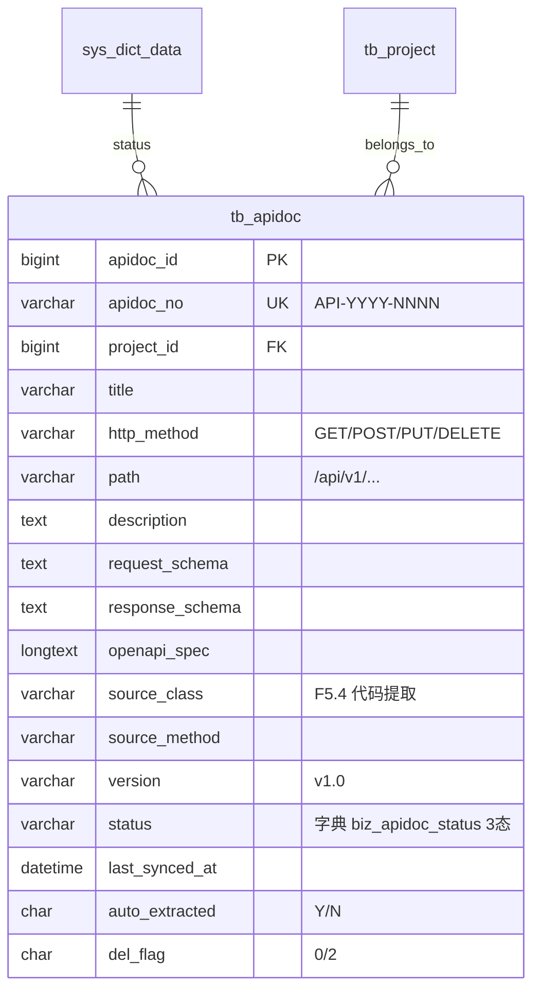

# Apidoc 模块 — 数据库设计 (骨架)

| 字段 | 值 |
|---|---|
| 版本 | v1.0-skeleton (派生于 commit b158d2f / 2026-05-17) |
| 关联 PRD | [Apidoc-PRD.md](../01-立项/Apidoc-PRD.md) |
| 表 | `tb_apidoc` |
| 编号规则 | `API-YYYY-NNNN` |
| 完整 DDL | [plm-backend/sql/business-apidoc.sql](../plm-backend/sql/business-apidoc.sql) |
| DBA review | Wjl ✅ (solo) |

## 1. 字段对照表

**单一事实来源**: [PRD-MAPPING.md §2 "Apidoc"](../PRD-MAPPING.md)。本文件**不重复字段表**,字段定义任何 drift 修复走 §M.2 流程。

## 2. 状态机字典

见 [PRD-MAPPING.md §3 状态机汇总](../PRD-MAPPING.md) 的 `apidoc` 行;SQL 字典数据见 SQL 文件 `sys_dict_data` 段。

## 3. 索引设计

详见 SQL 文件 `PRIMARY KEY` / `UNIQUE KEY` / `KEY` 定义。

## 4. 关系图 (ER)

**唯一键**: `UNIQUE(project_id, http_method, path, version)` — 同接口同版本禁重复 (701)。

## 5. 数据迁移
dev 环境:`mysql plm < sql/business-apidoc-rollback.sql && mysql plm < sql/business-apidoc.sql`。
生产部署:留 v1.0 GA 前补。

## 6. 容量预估

**分级**: 小规模(文档类)。按 5 个项目 × 100 接口/项目 × 平均 2 版本 = 1000 行/年估算,5 年累计 < 5000 行,表大小 < 200 MB。`openapi_spec` LONGTEXT 单行 5-15KB,`request_schema`/`response_schema` 各 1-3KB。索引覆盖 (project_id, http_method, path) 复合 + last_synced_at。无需分区。
