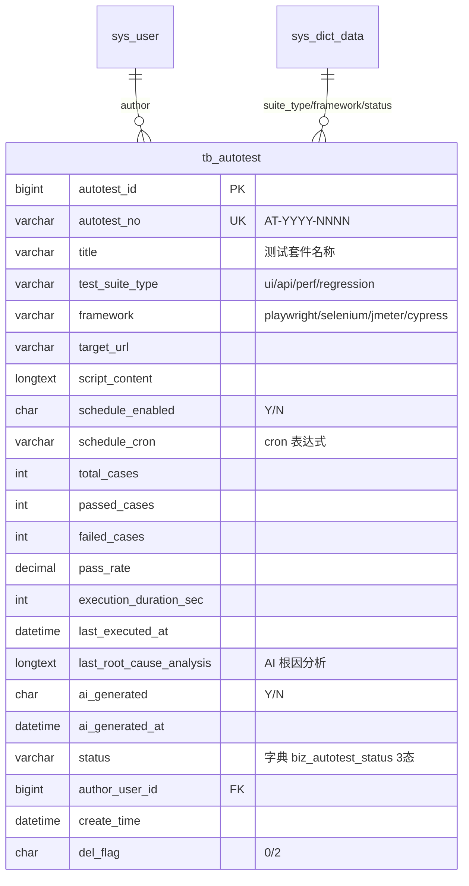

# Autotest 模块 — 数据库设计 (骨架)

| 字段 | 值 |
|---|---|
| 版本 | v1.0-skeleton (派生于 commit b158d2f / 2026-05-17) |
| 关联 PRD | [Autotest-PRD.md](../01-立项/Autotest-PRD.md) |
| 表 | `tb_autotest` |
| 编号规则 | `AT-YYYY-NNNN` |
| 完整 DDL | [plm-backend/sql/business-autotest.sql](../plm-backend/sql/business-autotest.sql) |
| DBA review | Wjl ✅ (solo) |

## 1. 字段对照表

**单一事实来源**: [PRD-MAPPING.md §2 "Autotest"](../PRD-MAPPING.md)。本文件**不重复字段表**,字段定义任何 drift 修复走 §M.2 流程。

## 2. 状态机字典

见 [PRD-MAPPING.md §3 状态机汇总](../PRD-MAPPING.md) 的 `autotest` 行;SQL 字典数据见 SQL 文件 `sys_dict_data` 段。

## 3. 索引设计

详见 SQL 文件 `PRIMARY KEY` / `UNIQUE KEY` / `KEY` 定义。

## 4. 关系图 (ER)

## 5. 数据迁移
dev 环境:`mysql plm < sql/business-autotest-rollback.sql && mysql plm < sql/business-autotest.sql`。
生产部署:留 v1.0 GA 前补。

## 6. 容量预估

**分级**: 中规模(质量类)。按 5 个项目 × 30 测试套件/项目 = 150 行/年估算,5 年累计 < 1500 行套件元数据(套件本身),但若计入每次运行结果(独立表) 则约 1500 × 200 次/年 = 30 万行/年,5 年累计 100-150 万行(>2 年归档)。本表只存最新元数据,`script_content`/`last_root_cause_analysis` LONGTEXT 各 20-50KB,需 status / framework 索引覆盖。
