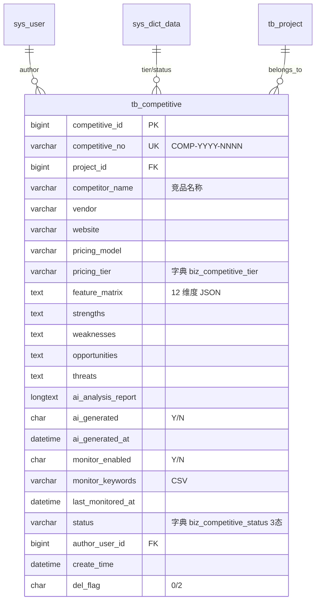

# Competitive 模块 — 数据库设计 (骨架)

| 字段 | 值 |
|---|---|
| 版本 | v1.0-skeleton (派生于 commit b158d2f / 2026-05-17) |
| 关联 PRD | [Competitive-PRD.md](../01-立项/Competitive-PRD.md) |
| 表 | `tb_competitive` |
| 编号规则 | `COMP-YYYY-NNNN` |
| 完整 DDL | [plm-backend/sql/business-competitive.sql](../plm-backend/sql/business-competitive.sql) |
| DBA review | Wjl ✅ (solo) |

## 1. 字段对照表

**单一事实来源**: [PRD-MAPPING.md §2 "Competitive"](../PRD-MAPPING.md)。本文件**不重复字段表**,字段定义任何 drift 修复走 §M.2 流程。

## 2. 状态机字典

见 [PRD-MAPPING.md §3 状态机汇总](../PRD-MAPPING.md) 的 `competitive` 行;SQL 字典数据见 SQL 文件 `sys_dict_data` 段。

## 3. 索引设计

详见 SQL 文件 `PRIMARY KEY` / `UNIQUE KEY` / `KEY` 定义。

## 4. 关系图 (ER)

## 5. 数据迁移
dev 环境:`mysql plm < sql/business-competitive-rollback.sql && mysql plm < sql/business-competitive.sql`。
生产部署:留 v1.0 GA 前补。

## 6. 容量预估

**分级**: 小规模(立项类)。按 5 个项目 × 10 竞品/项目 = 50 行/年估算,5 年累计 < 1 万行,表大小 < 100 MB。`ai_analysis_report` LONGTEXT 单行 10-30KB,`feature_matrix`/SWOT 4 字段各 ~1KB。无需分区,单表索引页面 < 50。
