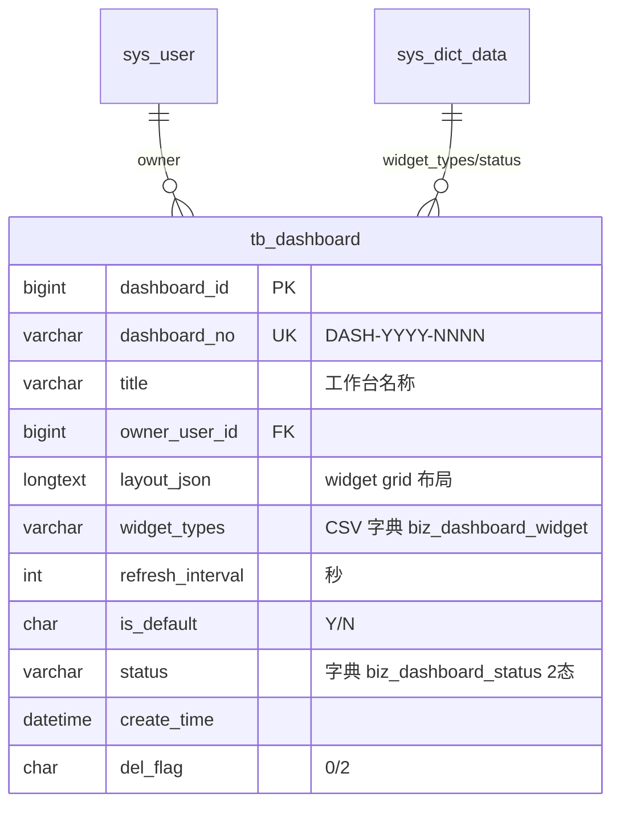

# Dashboard 模块 — 数据库设计 (骨架)

| 字段 | 值 |
|---|---|
| 版本 | v1.0-skeleton (派生于 commit b158d2f / 2026-05-17) |
| 关联 PRD | [Dashboard-PRD.md](../01-立项/Dashboard-PRD.md) |
| 表 | `tb_dashboard` |
| 编号规则 | `DASH-YYYY-NNNN` |
| 完整 DDL | [plm-backend/sql/business-dashboard.sql](../plm-backend/sql/business-dashboard.sql) |
| DBA review | Wjl ✅ (solo) |

## 1. 字段对照表

**单一事实来源**: [PRD-MAPPING.md §2 "Dashboard"](../PRD-MAPPING.md)。本文件**不重复字段表**,字段定义任何 drift 修复走 §M.2 流程。

## 2. 状态机字典

见 [PRD-MAPPING.md §3 状态机汇总](../PRD-MAPPING.md) 的 `dashboard` 行;SQL 字典数据见 SQL 文件 `sys_dict_data` 段。

## 3. 索引设计

详见 SQL 文件 `PRIMARY KEY` / `UNIQUE KEY` / `KEY` 定义。

## 4. 关系图 (ER)

**业务硬约束**: 同 `owner_user_id` 下 `is_default='Y'` 唯一(Service 层 `clearDefaultForOwner()`)。

## 5. 数据迁移
dev 环境:`mysql plm < sql/business-dashboard-rollback.sql && mysql plm < sql/business-dashboard.sql`。
生产部署:留 v1.0 GA 前补。

## 6. 容量预估

**分级**: 小规模(配置类)。按 50 个内部用户 × 3 工作台预设/用户 = 150 行总量(几乎是静态配置),5 年累计 < 500 行,表大小 < 10 MB。`layout_json` LONGTEXT 单行 2-5KB(widget 布局)。无需分区,索引覆盖 owner_user_id / is_default。
