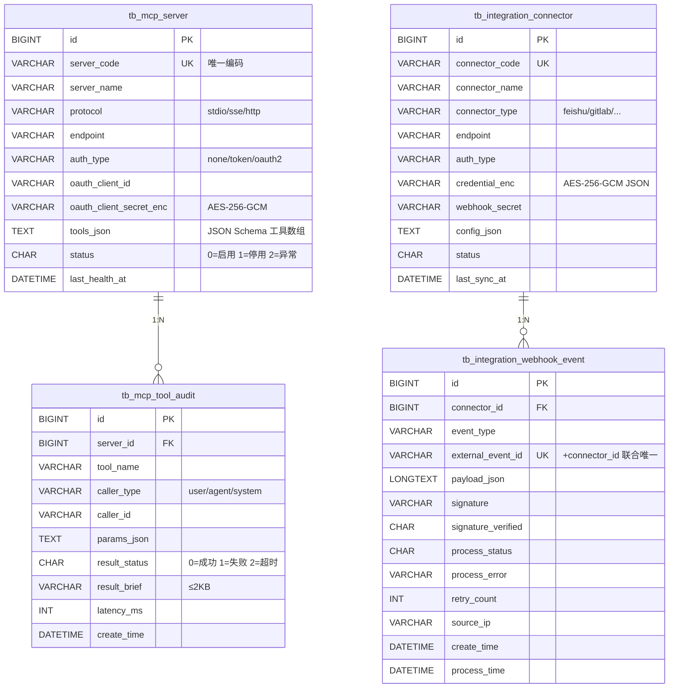
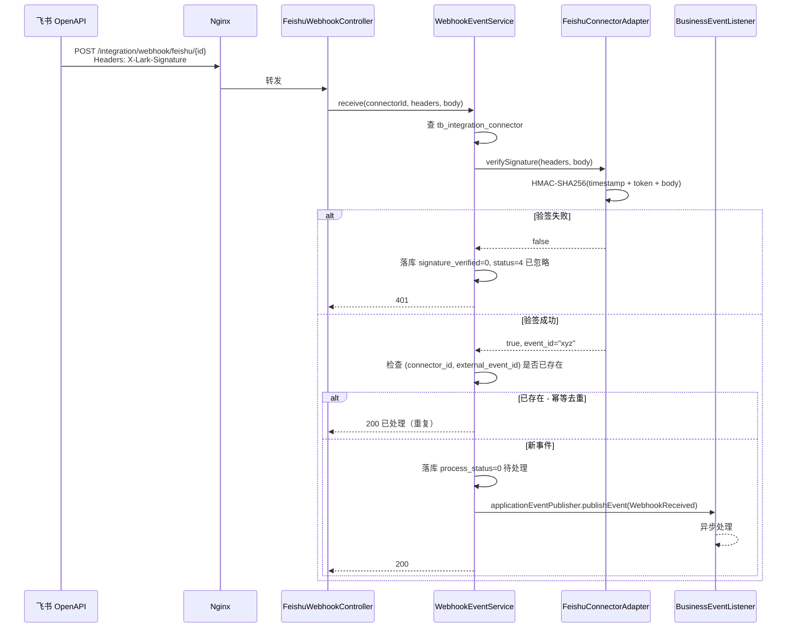
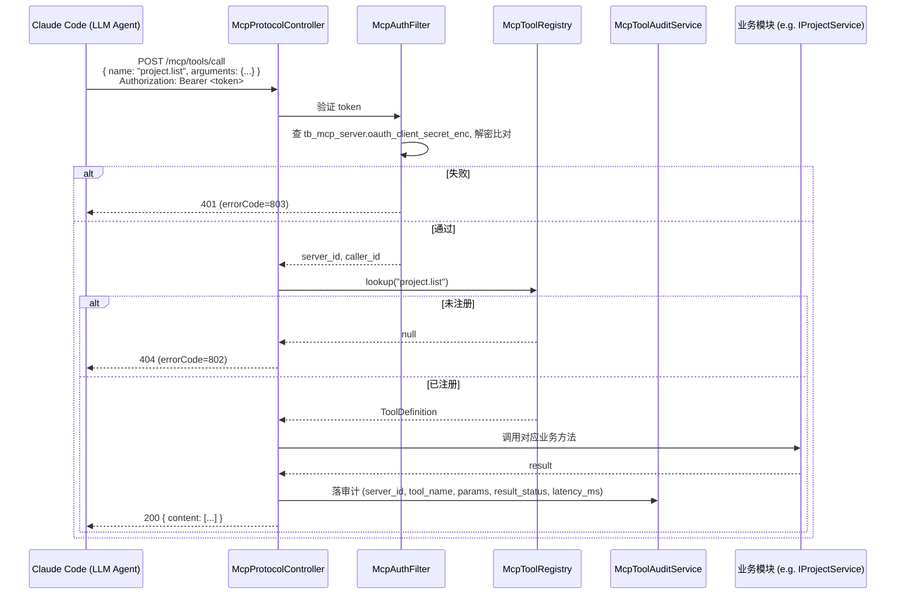

# MCP & 外部集成 — 系统/API/数据库 设计文档

> 模块：`plm-mcp` + `plm-integration`
> 关联 PRD：`prd和原型/AgriAI-PLM-完整PRD文档.md` §2.5 / §3.4 / §3.5 / §4.1
> 关联原型：`prd和原型/AgriPLM-DevOps-原型/agriplm_split/settings.html` Tab "MCP集成"
> 关联 Proposal：[99-跨阶段/proposals/0007-mcp-integration-modules-uplift.md](../99-跨阶段/proposals/0007-mcp-integration-modules-uplift.md)
> 关联 SSoT：[PRD-MAPPING.md §32-33](../PRD-MAPPING.md)

---

## 1. 范围与边界

### 1.1 包含

- **plm-mcp**：MCP Server 注册管理 + 工具调用审计 + 实现 MCP 协议端点（`tools/list` / `tools/call`），把 PLM 业务能力（project/requirement/task/testcase/document）暴露给外部 LLM Agent。
- **plm-integration**：管理与 飞书 / GitLab / 钉钉 / Jira / Figma / 禅道 / ZTF 等外部系统的连接器配置（凭据加密存储）+ Webhook 入站事件流水 + 出站 API 调用。

### 1.2 不包含

- agriplm-cli（Node.js 包发布到 npm，独立项目 v0.6+）
- Dify 工作流引擎接入（依然在 [99-跨阶段/AgriPLM-模块映射-2026-05-16.md](../99-跨阶段/AgriPLM-模块映射-2026-05-16.md) 剥离清单）
- Figma 设计稿语义解析（v0.5+）
- 双向同步的冲突合并策略（先做单向：PLM ↔ 外部主从单一方向）

---

## 2. C4 组件图（Container 级别）

```
┌──────────────────────────────────────────────────────────────────────────┐
│                          外部世界                                          │
│  ┌────────────┐ ┌────────────┐ ┌────────────┐ ┌────────────┐             │
│  │ 飞书 OpenAPI│ │ GitLab API │ │ Claude Code│ │ Cursor IDE │ ...         │
│  └─────┬──────┘ └─────┬──────┘ └─────┬──────┘ └─────┬──────┘             │
│        │              │              │ MCP          │ MCP                  │
└────────┼──────────────┼──────────────┼──────────────┼─────────────────────┘
         │ Webhook 入   │ API+Webhook  │ tools/list   │ tools/call
         │ /HTTP 出     │              │              │
┌────────▼──────────────▼──────────────▼──────────────▼─────────────────────┐
│                    PLM 后端 (plm-admin)                                    │
│                                                                            │
│  ┌──────────────────┐    ┌─────────────────┐                              │
│  │  plm-integration │    │   plm-mcp       │                              │
│  │ ──────────────── │    │ ─────────────── │                              │
│  │ ConnectorService │    │ McpServerSvc    │                              │
│  │ WebhookService   │    │ McpToolRegistry │                              │
│  │ ┌──────────────┐ │    │ McpProtocolEP   │                              │
│  │ │ FeishuClient │ │    │ McpAuditSvc     │                              │
│  │ │ GitLabClient │ │    └─────────────────┘                              │
│  │ │ (others...)  │ │                                                      │
│  │ └──────────────┘ │                                                      │
│  └────────┬─────────┘                                                      │
│           │ 调用                                                            │
│           ▼                                                                 │
│  ┌─────────────────────────────────────────────────────────────┐          │
│  │   现有业务模块（plm-project / plm-task / plm-defect/ ...）  │          │
│  └─────────────────────────────────────────────────────────────┘          │
│                                                                            │
└────────────────────────────────────────────────────────────────────────────┘
```

依赖方向：

- `plm-integration` → `plm-common` + `plm-system`（用 SecurityUtils）
- `plm-mcp` → `plm-common` + `plm-system` + （查询业务数据时延迟绑定，不直接依赖业务模块，通过 Spring 的 ApplicationContext 拿 Bean）
- `plm-admin` 依赖 plm-mcp 和 plm-integration

---

## 3. 数据库设计

### 3.1 ER 图（mermaid）



### 3.2 索引策略

| 表 | 索引 | 用途 |
|---|---|---|
| tb_mcp_server | UNIQUE(server_code) | 编码唯一 |
| tb_mcp_server | INDEX(status) | 列表按状态筛 |
| tb_mcp_tool_audit | INDEX(server_id, create_time) | 按 server 查最近调用 |
| tb_mcp_tool_audit | INDEX(tool_name) | 工具维度统计 |
| tb_mcp_tool_audit | INDEX(create_time) | 时间窗口扫描 |
| tb_integration_connector | UNIQUE(connector_code) | 编码唯一 |
| tb_integration_connector | INDEX(connector_type, status) | 列表按类型 + 状态 |
| tb_integration_webhook_event | UNIQUE(connector_id, external_event_id) | 幂等键 |
| tb_integration_webhook_event | INDEX(connector_id, create_time) | 按 connector 查时间线 |
| tb_integration_webhook_event | INDEX(process_status, create_time) | 待处理 / 失败重试扫描 |

### 3.3 DDL 草案

完整 DDL 见 [plm-backend/sql/business-mcp.sql](../plm-backend/sql/business-mcp.sql) 和 [plm-backend/sql/business-integration.sql](../plm-backend/sql/business-integration.sql)。

---

## 4. 安全模型

### 4.1 凭据存储（重点）

数据库中 `oauth_client_secret_enc` / `credential_enc` 列必须用 **AES-256-GCM** 加密，**不允许明文存储**。

- 加密 key：`MCP_ENCRYPT_KEY`，从 env 变量注入，长度 32 字节（base64 编码后 44 字符）
- 启动期校验：[plm-mcp/CryptoConfig](../plm-backend/plm-mcp/src/main/java/cn/com/bosssfot/dv/plm/mcp/config/McpCryptoConfig.java) 在 `@PostConstruct` 中检查 `MCP_ENCRYPT_KEY` 是否被设为默认值（`please-change-me-...`），若是则**抛 IllegalStateException 拒绝启动**（错误码 809）
- 密钥轮换：通过 `MCP_ENCRYPT_KEY_VERSION` 字段（v1, v2, ...）支持双密钥并存期；本期 v1 only
- DB 备份时 sysadmin 拿到密文也无法解出，符合 Phase 02 安全 Gate 要求

### 4.2 MCP 协议鉴权

| 阶段 | 鉴权方式 |
|---|---|
| Phase 1（本期） | 长效 token：每个 mcp_server 行配 `oauth_client_id` + `oauth_client_secret_enc`，外部 LLM Agent 调用时用 `Authorization: Bearer <token>` |
| Phase 2 | OAuth 2.0 Authorization Code Grant（用于真正的多 tenant SSO） |

所有 `/mcp/tools/*` 调用都 **同步** 落 `tb_mcp_tool_audit`（不在事务里，单独 Async DataSource 或同事务，本期同事务确保不丢）。

### 4.3 Webhook 验签

| 来源 | 验签算法 | 头部字段 | 失败行为 |
|---|---|---|---|
| 飞书 | challenge code（首次） + verification_token 校验 + HMAC-SHA256 / AES 加密事件 | `X-Lark-Request-Timestamp` / `X-Lark-Signature` | 落库 signature_verified=0, process_status=4 已忽略，401 |
| GitLab | X-Gitlab-Token == webhook_secret（明文比对） | `X-Gitlab-Token` | 同上 |
| 钉钉 | 同飞书（v0.6+） | - | - |

Webhook 入口端点 `/integration/webhook/{connector_type}/{connectorId}` **不在 JWT 鉴权范围**，但每次调用必须：

1. 查询 `tb_integration_connector` 是否存在且 status=0
2. 验签 → signature_verified 字段记录
3. 查 `(connector_id, external_event_id)` 唯一索引，**幂等去重**
4. 落 `tb_integration_webhook_event` 行，process_status=0 待处理
5. 异步分发（Phase 1 用 `@EventListener`，Phase 2 切到 Quartz Job 队列）

### 4.4 速率限制

- 出站调用飞书 / GitLab API 走 **Bucket4j 令牌桶**（v0.5+），本期仅捕获 HTTP 429 后落 `tb_integration_webhook_event.process_error` 并不抛
- 入站 Webhook 加 IP+connector_id 维度的 nginx limit_req（运维侧，不在 Java 代码中）

---

## 5. 关键时序图

### 5.1 飞书 Webhook 入站



### 5.2 MCP tools/call 工具调用



---

## 6. 已知约束与权衡

| 约束 | 取舍 |
|---|---|
| 本期不引入 Bucket4j 限流 | 飞书/GitLab API 限流告警依赖 webhook_event.process_error 字段做事后告警，不在调用时拦截 |
| Webhook 异步分发用 Spring `@EventListener` | 简单可用；不能保证宕机后重放。生产稳定后切 Quartz Job 队列（Phase 2） |
| MCP 协议 stdio 模式 | 本期只支持 http/SSE 模式；stdio 模式需要 PLM 主动 spawn 进程，与 web 容器模型不符，留作 Phase 2 |
| 工具注册采用静态配置 + 启动期扫 `@McpTool` 注解 | 简化，无需运行时动态注册接口 |
| 加密 key 单值 | 不支持 key rotation；轮换需停机 + 数据迁移。Phase 2 引入双 key 期 |

---

## 7. API 契约（摘要）

完整 API 文档将由 Springdoc 自动生成；本节列关键约束。

| Endpoint | Method | 权限 | 请求体 | 响应 |
|---|---|---|---|---|
| `/business/mcp/server/list` | GET | `business:mcp:server:list` | Page query | `TableDataInfo<McpServer>` |
| `/business/mcp/server` | POST | `business:mcp:server:add` | McpServer | `AjaxResult` |
| `/business/mcp/server/{id}` | DELETE | `business:mcp:server:remove` | path | `AjaxResult` |
| `/business/integration/connector/{id}/test` | POST | `business:integration:connector:test` | path | `AjaxResult` containing reachability + auth status |
| `/mcp/tools/list` | POST | OAuth token | JSON-RPC `{"jsonrpc":"2.0","method":"tools/list"}` | JSON-RPC tools 列表 |
| `/mcp/tools/call` | POST | OAuth token | JSON-RPC `{"method":"tools/call","params":{"name":"...","arguments":{...}}}` | JSON-RPC content |
| `/integration/webhook/feishu/{connectorId}` | POST | (公开 + 验签) | 飞书事件 payload | 200 / 401 / 200 已处理（幂等） |
| `/integration/webhook/gitlab/{connectorId}` | POST | (公开 + 验签) | GitLab event payload | 同上 |

---

## 8. 部署拓扑

```
┌────────────────┐         ┌────────────────┐
│ 公网 (Internet)│         │ 内网            │
│                │         │                 │
│ 飞书 API ──────┼─→ Nginx │ ┌─────────────┐ │
│ GitLab 实例 ───┼─→ (443) │ │ plm-admin   │ │
│                │         │ │ :8081       │ │
│ Claude Code ───┼─→ Nginx │ │ ┌─────────┐ │ │
│ Cursor ────────┼─→ (443) │ │ │plm-mcp  │ │ │
│                │         │ │ │plm-integ│ │ │
└────────────────┘         │ │ └─────────┘ │ │
                           │ └─────────────┘ │
                           │       │         │
                           │   MySQL+Redis   │
                           └────────────────┘
```

Nginx 路由：

- `/dev-api/business/*` → plm-admin :8081
- `/dev-api/integration/webhook/*` → plm-admin :8081（额外加 IP 白名单，限制为飞书/GitLab 出口段）
- `/dev-api/mcp/*` → plm-admin :8081

环境变量（[.env.example](../plm-backend/.env.example)）：

- `MCP_ENCRYPT_KEY` - 必填，AES-256-GCM 密钥（44 字符 base64）
- `MCP_OAUTH_ISSUER` - 选填，OAuth 颁发者，留 Phase 2
- `FEISHU_APP_ID` / `FEISHU_APP_SECRET` / `FEISHU_VERIFICATION_TOKEN` / `FEISHU_ENCRYPT_KEY` - 测试用沙箱
- `GITLAB_URL` / `GITLAB_TOKEN` - 测试用 PAT

---

## 9. 验收与测试

| 维度 | 验收 |
|---|---|
| 单元测试 | CryptoConfig（加密 key 缺失启动失败）、FeishuSignatureVerifier、GitLabSignatureVerifier、McpToolRegistry（注解扫描）|
| 集成测试 | 用 MockServer 模拟飞书/GitLab API，跑发消息 + 接 webhook 全链路 |
| 端到端 | 沙箱凭据下，PLM 创建一条 task，飞书机器人收到通知；GitLab MR 合入触发 webhook 落 webhook_event 表 |
| Gate Checklist | Phase 02 + Phase 03 各一份签字 |

---

## 10. 修订

| 日期 | 修改人 | 改了什么 |
|---|---|---|
| 2026-05-17 | Wjl + Claude | 初版（Proposal 0007 配套设计） |
