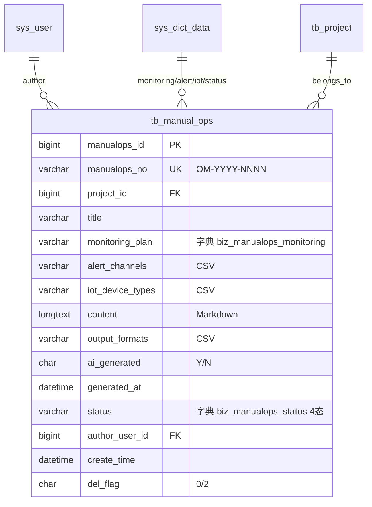

# ManualOps 模块 — 数据库设计 (骨架)

| 字段 | 值 |
|---|---|
| 版本 | v1.0-skeleton (派生于 commit b158d2f / 2026-05-17) |
| 关联 PRD | [ManualOps-PRD.md](../01-立项/ManualOps-PRD.md) |
| 表 | `tb_manual_ops` |
| 编号规则 | `OM-YYYY-NNNN` |
| 完整 DDL | [plm-backend/sql/business-manual-ops.sql](../plm-backend/sql/business-manual-ops.sql) |
| DBA review | Wjl ✅ (solo) |

## 1. 字段对照表

**单一事实来源**: [PRD-MAPPING.md §2 "ManualOps"](../PRD-MAPPING.md)。本文件**不重复字段表**,字段定义任何 drift 修复走 §M.2 流程。

## 2. 状态机字典

见 [PRD-MAPPING.md §3 状态机汇总](../PRD-MAPPING.md) 的 `manual-ops` 行;SQL 字典数据见 SQL 文件 `sys_dict_data` 段。

## 3. 索引设计

详见 SQL 文件 `PRIMARY KEY` / `UNIQUE KEY` / `KEY` 定义。

## 4. 关系图 (ER)

## 5. 数据迁移
dev 环境:`mysql plm < sql/business-manual-ops-rollback.sql && mysql plm < sql/business-manual-ops.sql`。
生产部署:留 v1.0 GA 前补。

## 6. 容量预估

**分级**: 小规模(文档类)。按 5 个项目 × 3 运维手册版本/项目 = 15 行/年估算,5 年累计 < 100 行,表大小 < 50 MB。`content` LONGTEXT 单行 30-80KB(含 IoT 巡检 SLA + 应急预案 Markdown)。无需分区。
