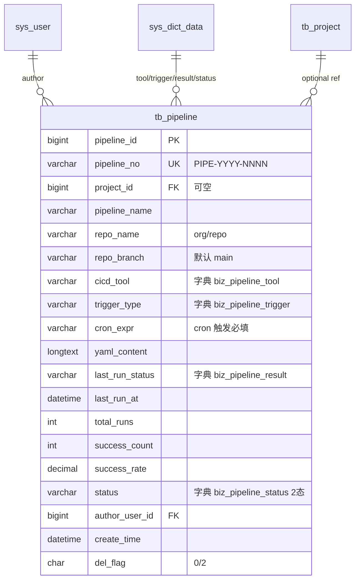

# Pipeline 模块 — 数据库设计 (骨架)

| 字段 | 值 |
|---|---|
| 版本 | v1.0-skeleton (派生于 commit b158d2f / 2026-05-17) |
| 关联 PRD | [Pipeline-PRD.md](../01-立项/Pipeline-PRD.md) |
| 表 | `tb_pipeline` |
| 编号规则 | `PIPE-YYYY-NNNN` |
| 完整 DDL | [plm-backend/sql/business-pipeline.sql](../plm-backend/sql/business-pipeline.sql) |
| DBA review | Wjl ✅ (solo) |

## 1. 字段对照表

**单一事实来源**: [PRD-MAPPING.md §2 "Pipeline"](../PRD-MAPPING.md)。本文件**不重复字段表**,字段定义任何 drift 修复走 §M.2 流程。

## 2. 状态机字典

见 [PRD-MAPPING.md §3 状态机汇总](../PRD-MAPPING.md) 的 `pipeline` 行;SQL 字典数据见 SQL 文件 `sys_dict_data` 段。

## 3. 索引设计

详见 SQL 文件 `PRIMARY KEY` / `UNIQUE KEY` / `KEY` 定义。

## 4. 关系图 (ER)

## 5. 数据迁移
dev 环境:`mysql plm < sql/business-pipeline-rollback.sql && mysql plm < sql/business-pipeline.sql`。
生产部署:留 v1.0 GA 前补。

## 6. 容量预估

**分级**: 大规模(流水线/DevOps 类)。按 100 条流水线 × 10 运行/天 = 365k 行/年(若按"每次运行落一行"模型),5 年累计 180 万行。但本表只存 Pipeline 配置元数据,行数 < 500(配置低增长);运行结果应进 `tb_pipeline_run` 独立表(按 RANGE BY YEAR(last_run_at) 分区,>2 年归档到冷库)。`yaml_content` LONGTEXT 单行 5-15KB。
