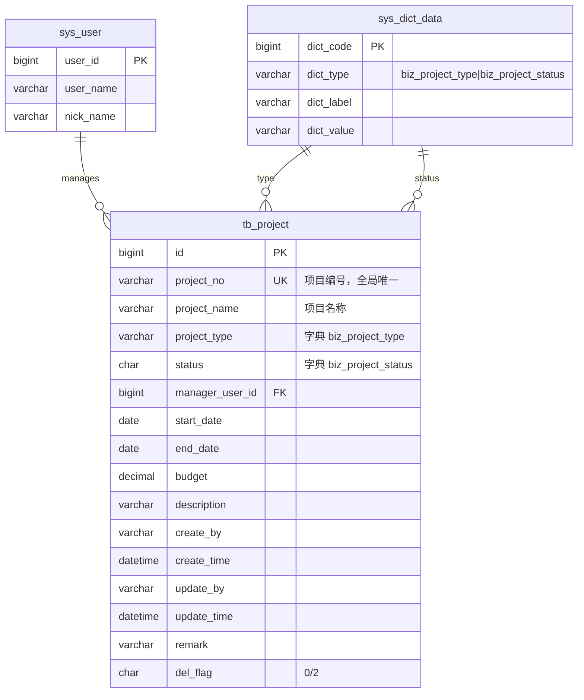

# Project 模块 — 数据库设计

| 字段 | 值 |
|---|---|
| 版本 | v1.0 |
| 关联 PRD | [Project-PRD.md](../01-立项/Project-PRD.md) §3.1 字段定义 |
| 关联 ADR | [ADR-0001 project_no 编号规则](../03-开发/ADR/0001-project-no-rule.md) |
| DBA review | Wjl ✅（solo） |

## 1. ER 图



## 2. DDL 草案

```sql
-- ============================================================
-- Project 业务表 (tb_project) — v1.0
-- ============================================================
DROP TABLE IF EXISTS tb_project;
CREATE TABLE tb_project (
    id                BIGINT(20)     NOT NULL AUTO_INCREMENT      COMMENT '主键',
    project_no        VARCHAR(64)    NOT NULL                     COMMENT '项目编号，全局唯一；规则见 ADR-0001',
    project_name      VARCHAR(128)   NOT NULL                     COMMENT '项目名称',
    project_type      VARCHAR(32)    DEFAULT ''                   COMMENT '项目类型（字典 biz_project_type）',
    status            CHAR(1)        DEFAULT '0'                  COMMENT '状态（字典 biz_project_status）',
    manager_user_id   BIGINT(20)     DEFAULT NULL                 COMMENT '项目经理用户ID（FK sys_user.user_id）',
    start_date        DATE           DEFAULT NULL                 COMMENT '起始日期',
    end_date          DATE           DEFAULT NULL                 COMMENT '结束日期',
    budget            DECIMAL(18, 2) DEFAULT NULL                 COMMENT '预算（万元）',
    description       VARCHAR(1000)  DEFAULT ''                   COMMENT '项目描述',
    create_by         VARCHAR(64)    DEFAULT ''                   COMMENT '创建者',
    create_time       DATETIME       DEFAULT NULL                 COMMENT '创建时间',
    update_by         VARCHAR(64)    DEFAULT ''                   COMMENT '更新者',
    update_time       DATETIME       DEFAULT NULL                 COMMENT '更新时间',
    remark            VARCHAR(500)   DEFAULT ''                   COMMENT '备注',
    del_flag          CHAR(1)        DEFAULT '0'                  COMMENT '删除标志（0=正常 2=删除）',
    PRIMARY KEY (id),
    UNIQUE KEY uk_project_no (project_no),
    KEY idx_project_status (status),
    KEY idx_project_manager (manager_user_id),
    KEY idx_project_create_time (create_time)
) ENGINE=InnoDB AUTO_INCREMENT=1 DEFAULT CHARSET=utf8mb4 COMMENT='项目（Project）';

-- ============================================================
-- 字典类型
-- ============================================================
INSERT INTO sys_dict_type (dict_name, dict_type, status, create_by, create_time, remark) VALUES
('项目类型', 'biz_project_type',   '0', 'admin', SYSDATE(), '项目分类'),
('项目状态', 'biz_project_status', '0', 'admin', SYSDATE(), '项目生命周期状态');

-- ============================================================
-- 字典数据
-- ============================================================
-- 项目类型
INSERT INTO sys_dict_data (dict_sort, dict_label, dict_value, dict_type, css_class, list_class, is_default, status, create_by, create_time, remark) VALUES
(1, '研发', 'rnd',     'biz_project_type', '', 'primary', 'N', '0', 'admin', SYSDATE(), '研发类项目'),
(2, '改造', 'upgrade', 'biz_project_type', '', 'success', 'N', '0', 'admin', SYSDATE(), '改造类项目'),
(3, '运维', 'ops',     'biz_project_type', '', 'info',    'N', '0', 'admin', SYSDATE(), '运维类项目');

-- 项目状态（与 PRD §3.3 状态机一致）
INSERT INTO sys_dict_data (dict_sort, dict_label, dict_value, dict_type, css_class, list_class, is_default, status, create_by, create_time, remark) VALUES
(1, '未启动', '0', 'biz_project_status', '', 'info',    'Y', '0', 'admin', SYSDATE(), ''),
(2, '进行中', '1', 'biz_project_status', '', 'primary', 'N', '0', 'admin', SYSDATE(), ''),
(3, '暂停',   '2', 'biz_project_status', '', 'warning', 'N', '0', 'admin', SYSDATE(), ''),
(4, '已完成', '3', 'biz_project_status', '', 'success', 'N', '0', 'admin', SYSDATE(), ''),
(5, '已取消', '4', 'biz_project_status', '', 'danger',  'N', '0', 'admin', SYSDATE(), '');

-- ============================================================
-- 菜单与权限（菜单 ID 从 2000 起）
-- ============================================================
INSERT INTO sys_menu VALUES
(2000, '业务管理',     0,    5, 'business',           NULL,                         '', '', 1, 0, 'M', '0', '0', '',                            'component', 'admin', SYSDATE(), '', NULL, '业务管理目录'),
(2010, '项目管理',     2000, 1, 'project',            'business/project/index',     '', '', 1, 0, 'C', '0', '0', 'business:project:list',       'tree-table', 'admin', SYSDATE(), '', NULL, '项目管理菜单'),
(2011, '项目查询',     2010, 1, '#',                  '',                           '', '', 1, 0, 'F', '0', '0', 'business:project:query',      '#', 'admin', SYSDATE(), '', NULL, ''),
(2012, '项目新增',     2010, 2, '#',                  '',                           '', '', 1, 0, 'F', '0', '0', 'business:project:add',        '#', 'admin', SYSDATE(), '', NULL, ''),
(2013, '项目修改',     2010, 3, '#',                  '',                           '', '', 1, 0, 'F', '0', '0', 'business:project:edit',       '#', 'admin', SYSDATE(), '', NULL, ''),
(2014, '项目删除',     2010, 4, '#',                  '',                           '', '', 1, 0, 'F', '0', '0', 'business:project:remove',     '#', 'admin', SYSDATE(), '', NULL, ''),
(2015, '项目导出',     2010, 5, '#',                  '',                           '', '', 1, 0, 'F', '0', '0', 'business:project:export',     '#', 'admin', SYSDATE(), '', NULL, '');

-- admin (role_id=1) 授权全部
INSERT INTO sys_role_menu VALUES (1, 2000), (1, 2010), (1, 2011), (1, 2012), (1, 2013), (1, 2014), (1, 2015);
```

## 3. 索引策略

| 索引 | 类型 | 列 | 用途 |
|---|---|---|---|
| `PRIMARY` | clustered | `id` | 主键 |
| `uk_project_no` | unique | `project_no` | 编号唯一性 + 按编号精确查（B-Tree） |
| `idx_project_status` | secondary | `status` | 列表按状态筛选（高频） |
| `idx_project_manager` | secondary | `manager_user_id` | "我的项目"过滤 |
| `idx_project_create_time` | secondary | `create_time` | 默认排序 + 时间范围筛选 |

**不建组合索引** — `tb_project` 量级 < 万行，单列索引 + MySQL 优化器足够。若 v0.2 数据量上升再 EXPLAIN 后决议。

## 4. 命名规范遵守

按 [开发规范.md §0](../03-开发/开发规范.md)：
- ✅ 表名 `tb_project`（`tb_` 前缀）
- ✅ 列名 snake_case
- ✅ 通用 6 字段：`create_by/create_time/update_by/update_time/remark/del_flag`
- ✅ 字典 type `biz_project_*`（`biz_` 前缀，避免与 `sys_*` 冲突）
- ✅ 索引 `idx_<table>_<col>` / 唯一索引 `uk_<table>_<col>`

## 5. 迁移方案

### 5.1 v0.1 上线（首次建表）

**脚本位置**：`plm-backend/sql/business-project.sql`
**导入命令**（注意 utf8mb4）：

```bash
"$MYSQL" -uroot -p... --default-character-set=utf8mb4 plm < sql/business-project.sql
```

### 5.2 回滚方案

```sql
-- 删菜单（先删权限明细 → 主菜单 → 父目录）
DELETE FROM sys_role_menu WHERE menu_id IN (2000, 2010, 2011, 2012, 2013, 2014, 2015);
DELETE FROM sys_menu WHERE menu_id IN (2011, 2012, 2013, 2014, 2015);
DELETE FROM sys_menu WHERE menu_id = 2010;
DELETE FROM sys_menu WHERE menu_id = 2000;

-- 删字典数据
DELETE FROM sys_dict_data WHERE dict_type IN ('biz_project_type', 'biz_project_status');
DELETE FROM sys_dict_type WHERE dict_type IN ('biz_project_type', 'biz_project_status');

-- 业务表
DROP TABLE IF EXISTS tb_project;
```

回滚脚本应作为 `business-project-rollback.sql` 与 forward 脚本配对入库（Phase 03 开发时一并创建）。

### 5.3 未来版本（v0.2+）

引入 Flyway 或 Liquibase：约定迁移脚本命名 `V<NN>__<描述>.sql`。本期不引入（Phase 02 暂不决，留 v0.2 时另起 ADR）。

## 6. Phase 03 实施清单

数据库设计落地的最小动作集（给开发 lead）：

- [ ] 用 `ruoyi-bootstrap` skill Phase 7 模板生成 `business-project.sql` + Domain/Mapper/Service/Controller
- [ ] 验证 DDL 在 dev MySQL 执行无错（charset utf8mb4 + 列 comment 完整）
- [ ] 字典值通过浏览器在 `系统管理 → 字典管理 → biz_project_type/status` 可见
- [ ] 菜单值通过浏览器在 `系统管理 → 菜单管理 → 业务管理` 可见
- [ ] 写回滚脚本 `business-project-rollback.sql`
