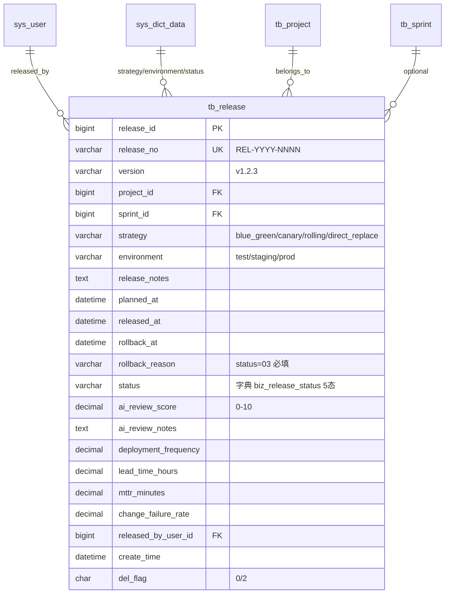

# Release 模块 — 数据库设计 (骨架)

| 字段 | 值 |
|---|---|
| 版本 | v1.0-skeleton (派生于 commit b158d2f / 2026-05-17) |
| 关联 PRD | [Release-PRD.md](../01-立项/Release-PRD.md) |
| 表 | `tb_release` |
| 编号规则 | `REL-YYYY-NNNN` |
| 完整 DDL | [plm-backend/sql/business-release.sql](../plm-backend/sql/business-release.sql) |
| DBA review | Wjl ✅ (solo) |

## 1. 字段对照表

**单一事实来源**: [PRD-MAPPING.md §2 "Release"](../PRD-MAPPING.md)。本文件**不重复字段表**,字段定义任何 drift 修复走 §M.2 流程。

## 2. 状态机字典

见 [PRD-MAPPING.md §3 状态机汇总](../PRD-MAPPING.md) 的 `release` 行;SQL 字典数据见 SQL 文件 `sys_dict_data` 段。

## 3. 索引设计

详见 SQL 文件 `PRIMARY KEY` / `UNIQUE KEY` / `KEY` 定义。

## 4. 关系图 (ER)

**唯一键**: `UNIQUE(project_id, version)` — 同项目同版本号禁重复 (701)。

## 5. 数据迁移
dev 环境:`mysql plm < sql/business-release-rollback.sql && mysql plm < sql/business-release.sql`。
生产部署:留 v1.0 GA 前补。

## 6. 容量预估

**分级**: 大规模(发布/DevOps 类)。按 5 个项目 × 24 发布/年(双周发版)= 120 行/年,5 年累计 < 1000 行,看似不大,但实际 DORA 指标 4 字段每次发布写入,(project_id, environment, released_at) 高频查询用于 DORA 聚合(配合 plm-dora)。`release_notes` TEXT 2-5KB,`ai_review_notes` TEXT 1-3KB。考虑 RANGE BY YEAR(released_at) 分区(发布历史 >3 年归档),复合索引 (project_id, released_at)。
