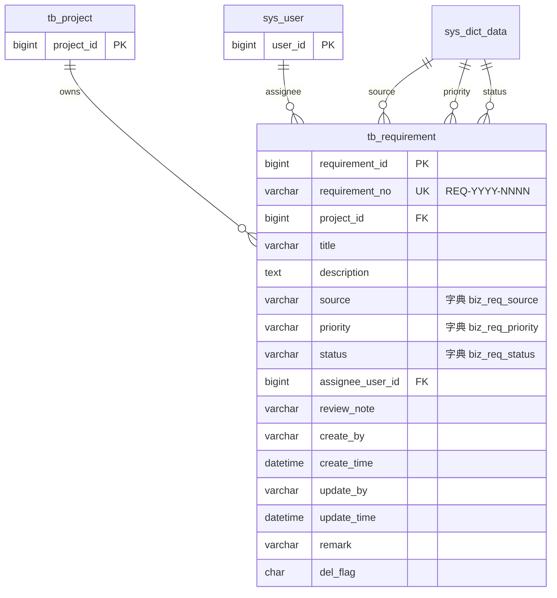

# Requirement 模块 — 数据库设计

| 字段 | 值 |
|---|---|
| 版本 | v1.0 |
| 关联 PRD | [Requirement-PRD.md](../01-立项/Requirement-PRD.md) §3.1 字段定义 |
| 关联 ADR | ADR-0002 草案 (REQ-YYYY-NNNN 编号规则,沿用 ADR-0001 模式) |
| DBA review | Wjl ✅ (solo) |
| 菜单 ID 段 | 2020-2026 (业务管理 2000 下挂二级 需求管理 2020 + 6 按钮) |

## 1. ER 图



## 2. DDL 草案

```sql
-- ============================================================
-- Requirement 业务表 (tb_requirement) — v1.0
-- ============================================================
DROP TABLE IF EXISTS tb_requirement;
CREATE TABLE tb_requirement (
    requirement_id    BIGINT(20)    NOT NULL AUTO_INCREMENT  COMMENT '主键',
    requirement_no    VARCHAR(32)   NOT NULL                 COMMENT '需求编号 REQ-YYYY-NNNN;ADR-0002',
    project_id        BIGINT(20)    NOT NULL                 COMMENT '所属项目 FK→tb_project.project_id',
    title             VARCHAR(200)  NOT NULL                 COMMENT '需求标题',
    description       TEXT                                   COMMENT '详细描述(Markdown 兼容)',
    source            VARCHAR(2)    NOT NULL DEFAULT '01'    COMMENT '需求来源(字典 biz_req_source)',
    priority          VARCHAR(2)    NOT NULL DEFAULT '02'    COMMENT '优先级(字典 biz_req_priority)',
    status            VARCHAR(2)    NOT NULL DEFAULT '00'    COMMENT '状态(字典 biz_req_status)',
    assignee_user_id  BIGINT(20)    DEFAULT NULL             COMMENT '指派给的用户 FK→sys_user.user_id',
    review_note       VARCHAR(500)  DEFAULT NULL             COMMENT '评审简要纪要(状态推进时填)',
    create_by         VARCHAR(64)   DEFAULT ''               COMMENT '创建者',
    create_time       DATETIME      DEFAULT NULL             COMMENT '创建时间',
    update_by         VARCHAR(64)   DEFAULT ''               COMMENT '更新者',
    update_time       DATETIME      DEFAULT NULL             COMMENT '更新时间',
    remark            VARCHAR(500)  DEFAULT ''               COMMENT '备注',
    del_flag          CHAR(1)       DEFAULT '0'              COMMENT '0=正常 2=删除',
    PRIMARY KEY (requirement_id),
    UNIQUE KEY uk_requirement_no (requirement_no),
    KEY idx_requirement_project (project_id),
    KEY idx_requirement_status (status),
    KEY idx_requirement_priority_status (priority, status)
) ENGINE=InnoDB AUTO_INCREMENT=1 DEFAULT CHARSET=utf8mb4 COMMENT='需求(Requirement)';

-- ============================================================
-- 字典类型 (3 个新增)
-- ============================================================
INSERT INTO sys_dict_type (dict_name, dict_type, status, create_by, create_time, remark) VALUES
('需求来源',   'biz_req_source',   '0', 'admin', SYSDATE(), '需求来源分类'),
('需求优先级', 'biz_req_priority', '0', 'admin', SYSDATE(), '需求优先级 P0/P1/P2'),
('需求状态',   'biz_req_status',   '0', 'admin', SYSDATE(), '需求生命周期状态');

-- ============================================================
-- 字典数据 (4 + 3 + 4 = 11 条)
-- ============================================================
-- 来源
INSERT INTO sys_dict_data (dict_sort, dict_label, dict_value, dict_type, css_class, list_class, is_default, status, create_by, create_time, remark) VALUES
(1, '客户反馈', '01', 'biz_req_source',   '', 'primary', 'Y', '0', 'admin', SYSDATE(), ''),
(2, '内部提案', '02', 'biz_req_source',   '', 'info',    'N', '0', 'admin', SYSDATE(), ''),
(3, '运营数据', '03', 'biz_req_source',   '', 'warning', 'N', '0', 'admin', SYSDATE(), ''),
(4, '竞品分析', '04', 'biz_req_source',   '', 'success', 'N', '0', 'admin', SYSDATE(), '');

-- 优先级 (P0/P1/P2)
INSERT INTO sys_dict_data (dict_sort, dict_label, dict_value, dict_type, css_class, list_class, is_default, status, create_by, create_time, remark) VALUES
(1, 'P0 紧急', '00', 'biz_req_priority', '', 'danger',  'N', '0', 'admin', SYSDATE(), ''),
(2, 'P1 重要', '01', 'biz_req_priority', '', 'warning', 'N', '0', 'admin', SYSDATE(), ''),
(3, 'P2 一般', '02', 'biz_req_priority', '', 'info',    'Y', '0', 'admin', SYSDATE(), '');

-- 状态 (与 PRD §3.3 4×4 状态机一致)
INSERT INTO sys_dict_data (dict_sort, dict_label, dict_value, dict_type, css_class, list_class, is_default, status, create_by, create_time, remark) VALUES
(1, '待评审', '00', 'biz_req_status',   '', 'info',    'Y', '0', 'admin', SYSDATE(), ''),
(2, '开发中', '01', 'biz_req_status',   '', 'primary', 'N', '0', 'admin', SYSDATE(), ''),
(3, '已完成', '02', 'biz_req_status',   '', 'success', 'N', '0', 'admin', SYSDATE(), '终态'),
(4, '已取消', '03', 'biz_req_status',   '', 'danger',  'N', '0', 'admin', SYSDATE(), '终态');

-- ============================================================
-- 菜单与权限 (菜单 ID 2020-2026,挂在业务管理 2000 下)
-- ============================================================
INSERT INTO sys_menu VALUES
(2020, '需求管理', 2000, 2, 'requirement',    'business/requirement/index', '', '', 1, 0, 'C', '0', '0', 'business:requirement:list',   'edit',  'admin', SYSDATE(), '', NULL, '需求管理菜单'),
(2021, '需求查询', 2020, 1, '#',              '',                            '', '', 1, 0, 'F', '0', '0', 'business:requirement:query',  '#',     'admin', SYSDATE(), '', NULL, ''),
(2022, '需求新增', 2020, 2, '#',              '',                            '', '', 1, 0, 'F', '0', '0', 'business:requirement:add',    '#',     'admin', SYSDATE(), '', NULL, ''),
(2023, '需求修改', 2020, 3, '#',              '',                            '', '', 1, 0, 'F', '0', '0', 'business:requirement:edit',   '#',     'admin', SYSDATE(), '', NULL, ''),
(2024, '需求删除', 2020, 4, '#',              '',                            '', '', 1, 0, 'F', '0', '0', 'business:requirement:remove', '#',     'admin', SYSDATE(), '', NULL, ''),
(2025, '需求导出', 2020, 5, '#',              '',                            '', '', 1, 0, 'F', '0', '0', 'business:requirement:export', '#',     'admin', SYSDATE(), '', NULL, '');

-- admin 角色全量授权 (note: 2020-2025 共 6 个;一级菜单 + 5 按钮)
INSERT INTO sys_role_menu VALUES (1, 2020), (1, 2021), (1, 2022), (1, 2023), (1, 2024), (1, 2025);
```

## 3. 索引策略

| 索引 | 列 | 用途 |
|---|---|---|
| `PRIMARY` | `requirement_id` | 主键 |
| `uk_requirement_no` | `requirement_no` | 编号唯一 + 按编号精确查 |
| `idx_requirement_project` | `project_id` | **Project 详情页"关联需求 Tab"必经索引** |
| `idx_requirement_status` | `status` | 列表按状态筛选 |
| `idx_requirement_priority_status` | (priority, status) | P0/P1 紧急看板查询(组合索引) |

> 比 Project 多了组合索引 `(priority, status)` — 因为 PRD §3.2 R-001 提到"P0/P1 紧急看板"是高频场景。Project 量级小,本表会因 Project 多个需求而膨胀更快,提前布局。

## 4. 命名规范遵守

- ✅ 表名 `tb_requirement`(`tb_` 前缀)
- ✅ 列名 snake_case
- ✅ 通用 6 字段
- ✅ 字典 type `biz_req_*`(避免与 Project 的 `biz_project_*` 重名冲突)
- ✅ 索引 `idx_<table>_<col>` / 唯一 `uk_<table>_<col>`
- ✅ 主键命名 `requirement_id`(与 Project 的 `id` 不同;按"主键 = 表名_id"统一,后续 Project 在 v0.3 数据迁移 stub 时再考虑统一)

> **§4 命名 friction**: Project 用 `id`,Requirement 用 `requirement_id`。建议在 ADR-0005(待立)统一为 `<table>_id` 模式。这是已识别技术债,本期接受。

## 5. 迁移方案

**脚本位置**: `plm-backend/sql/business-requirement.sql`

**导入命令**:
```bash
"$MYSQL" -uroot -p... --default-character-set=utf8mb4 plm < sql/business-requirement.sql
```

**回滚脚本** `business-requirement-rollback.sql`:
```sql
DELETE FROM sys_role_menu WHERE menu_id BETWEEN 2020 AND 2025;
DELETE FROM sys_menu WHERE menu_id BETWEEN 2020 AND 2025;
DELETE FROM sys_dict_data WHERE dict_type IN ('biz_req_source', 'biz_req_priority', 'biz_req_status');
DELETE FROM sys_dict_type WHERE dict_type IN ('biz_req_source', 'biz_req_priority', 'biz_req_status');
DROP TABLE IF EXISTS tb_requirement;
```

## 6. Phase 03 实施清单

- [ ] 用 ruoyi-bootstrap skill Phase 7 生成 Requirement 模板
- [ ] DDL 在 dev MySQL 执行无错(charset utf8mb4 + 列 comment)
- [ ] 11 条字典数据通过浏览器 `系统管理 → 字典管理` 可见
- [ ] 菜单 `系统管理 → 菜单管理 → 业务管理 → 需求管理` 可见
- [ ] 写回滚脚本
- [ ] 单测覆盖 4×4 状态机所有边(允许 ✅ + 禁止 ❌ 共 16 case)

## 7. 变更记录

| 版本 | 日期 | 变更 |
|---|---|---|
| v1.0 | 2026-05-16 | 初版 |
