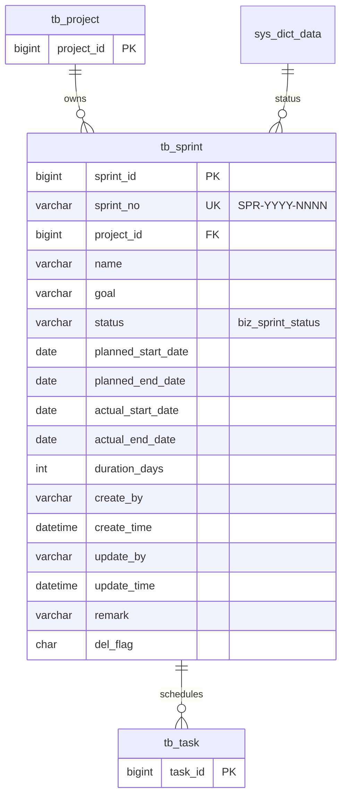

# Sprint 模块 — 数据库设计

| 字段 | 值 |
|---|---|
| 版本 | v1.0 |
| 关联 PRD | [Sprint-PRD.md](../01-立项/Sprint-PRD.md) §3.1 |
| 关联 ADR | ADR-0004 草案 (SPR-YYYY-NNNN) |
| DBA review | Wjl ✅ (solo) |
| 菜单 ID 段 | 2040-2046 (业务管理 2000 下挂 迭代管理 2040 + 6 按钮) |

## 1. ER 图



## 2. DDL 草案

```sql
-- ============================================================
-- Sprint 业务表 (tb_sprint) — v1.0
-- ============================================================
DROP TABLE IF EXISTS tb_sprint;
CREATE TABLE tb_sprint (
    sprint_id            BIGINT(20)    NOT NULL AUTO_INCREMENT  COMMENT '主键',
    sprint_no            VARCHAR(32)   NOT NULL                 COMMENT '迭代编号 SPR-YYYY-NNNN;ADR-0004',
    project_id           BIGINT(20)    NOT NULL                 COMMENT '所属项目 FK→tb_project',
    name                 VARCHAR(100)  NOT NULL                 COMMENT '迭代名称(如 Sprint 26W21)',
    goal                 VARCHAR(500)  DEFAULT NULL             COMMENT '迭代目标(一句话)',
    status               VARCHAR(2)    NOT NULL DEFAULT '00'    COMMENT '状态(字典 biz_sprint_status)',
    planned_start_date   DATE          NOT NULL                 COMMENT '计划开始日',
    planned_end_date     DATE          NOT NULL                 COMMENT '计划结束日',
    actual_start_date    DATE          DEFAULT NULL             COMMENT '实际开始(00→01 时自动填)',
    actual_end_date      DATE          DEFAULT NULL             COMMENT '实际结束(01→02 时自动填)',
    duration_days        INT           DEFAULT 14               COMMENT '周期天数(冗余,便于查询)',
    create_by            VARCHAR(64)   DEFAULT ''               COMMENT '创建者',
    create_time          DATETIME      DEFAULT NULL             COMMENT '创建时间',
    update_by            VARCHAR(64)   DEFAULT ''               COMMENT '更新者',
    update_time          DATETIME      DEFAULT NULL             COMMENT '更新时间',
    remark               VARCHAR(500)  DEFAULT ''               COMMENT '备注',
    del_flag             CHAR(1)       DEFAULT '0'              COMMENT '0=正常 2=删除',
    PRIMARY KEY (sprint_id),
    UNIQUE KEY uk_sprint_no (sprint_no),
    KEY idx_sprint_project_status (project_id, status),
    KEY idx_sprint_planned_dates (planned_start_date, planned_end_date)
) ENGINE=InnoDB AUTO_INCREMENT=1 DEFAULT CHARSET=utf8mb4 COMMENT='迭代(Sprint)';

-- ============================================================
-- 字典类型 (1 个)
-- ============================================================
INSERT INTO sys_dict_type (dict_name, dict_type, status, create_by, create_time, remark) VALUES
('迭代状态', 'biz_sprint_status', '0', 'admin', SYSDATE(), '迭代 4 状态机');

-- ============================================================
-- 字典数据 (4 条)
-- ============================================================
INSERT INTO sys_dict_data (dict_sort, dict_label, dict_value, dict_type, css_class, list_class, is_default, status, create_by, create_time, remark) VALUES
(1, '计划中', '00', 'biz_sprint_status', '', 'info',    'Y', '0', 'admin', SYSDATE(), ''),
(2, '进行中', '01', 'biz_sprint_status', '', 'primary', 'N', '0', 'admin', SYSDATE(), ''),
(3, '已完成', '02', 'biz_sprint_status', '', 'success', 'N', '0', 'admin', SYSDATE(), '终态'),
(4, '已取消', '03', 'biz_sprint_status', '', 'danger',  'N', '0', 'admin', SYSDATE(), '终态');

-- ============================================================
-- 菜单与权限 (菜单 ID 2040-2046)
-- ============================================================
INSERT INTO sys_menu VALUES
(2040, '迭代管理', 2000, 4, 'sprint',         'business/sprint/index',       '', '', 1, 0, 'C', '0', '0', 'business:sprint:list',   'time',     'admin', SYSDATE(), '', NULL, '迭代管理菜单'),
(2041, '迭代查询', 2040, 1, '#',              '',                            '', '', 1, 0, 'F', '0', '0', 'business:sprint:query',  '#',        'admin', SYSDATE(), '', NULL, ''),
(2042, '迭代新增', 2040, 2, '#',              '',                            '', '', 1, 0, 'F', '0', '0', 'business:sprint:add',    '#',        'admin', SYSDATE(), '', NULL, ''),
(2043, '迭代修改', 2040, 3, '#',              '',                            '', '', 1, 0, 'F', '0', '0', 'business:sprint:edit',   '#',        'admin', SYSDATE(), '', NULL, ''),
(2044, '迭代删除', 2040, 4, '#',              '',                            '', '', 1, 0, 'F', '0', '0', 'business:sprint:remove', '#',        'admin', SYSDATE(), '', NULL, ''),
(2045, '迭代导出', 2040, 5, '#',              '',                            '', '', 1, 0, 'F', '0', '0', 'business:sprint:export', '#',        'admin', SYSDATE(), '', NULL, ''),
(2046, '迭代统计', 2040, 6, '#',              '',                            '', '', 1, 0, 'F', '0', '0', 'business:sprint:stats',  '#',        'admin', SYSDATE(), '', NULL, '健康度统计(S-009)');

-- admin 角色全量授权
INSERT INTO sys_role_menu VALUES (1, 2040), (1, 2041), (1, 2042), (1, 2043), (1, 2044), (1, 2045), (1, 2046);
```

## 3. 索引策略

| 索引 | 列 | 用途 |
|---|---|---|
| `PRIMARY` | `sprint_id` | 主键 |
| `uk_sprint_no` | `sprint_no` | 编号唯一 |
| `idx_sprint_project_status` | (project_id, status) | **核心索引** — "查项目下的活跃迭代"(`current` 端点)+ "项目下迭代列表"(项目详情页 Tab) |
| `idx_sprint_planned_dates` | (planned_start_date, planned_end_date) | 时间范围筛选(月度复盘) |

> **比 Project / Requirement / Task 都少**(4 个 vs 5-7 个) — Sprint 数据量低(每项目每两周 1 个,1 年 ~26 条),索引精简。

**为什么没建 idx_sprint_status 单列索引**: 因为 `status='01' 进行中` 全局唯一(项目级单一活跃约束 703),独立查全部 active 时直接 SELECT *,数据量极少;查"项目下的 active"用复合索引 `(project_id, status)` 更有效。

## 4. "项目级单一活跃迭代"约束实现 (PRD 错误码 703)

```java
// SprintMapper.xml
<select id="countActiveByProject" parameterType="Map" resultType="int">
    SELECT COUNT(1) FROM tb_sprint
    WHERE project_id = #{projectId}
      AND status = '01'
      AND del_flag = '0'
      AND sprint_id != #{excludeSprintId}  -- 排除自己(用于 update 时)
</select>
```

```java
// SprintServiceImpl.updateStatus() 简化版
if ("01".equals(newStatus)) {
    int activeCount = mapper.countActiveByProject(projectId, sprintId);
    if (activeCount > 0) {
        throw new ServiceException("项目已有活跃迭代", 703);
    }
}
```

**并发场景**(Phase 03 必须处理):
- 简单方案: `@Transactional` + 在 update 前做 `SELECT FOR UPDATE` (悲观锁) — 性能可接受(Sprint 数据量极小)
- 替代方案: 引入乐观锁字段 `@Version version` — Phase 03 评估后决定

## 5. 命名规范

- ✅ 主键 `sprint_id` (沿用 `<table>_id` 模式)
- ✅ 表前缀 `tb_`,字典前缀 `biz_sprint_*`,索引前缀 `idx_sprint_*`
- ✅ 通用 6 字段
- ✅ 业务字段 `actual_start_date` / `actual_end_date` 使用 `actual_` 前缀,与 `planned_*` 对偶,语义清晰

## 6. 迁移方案

**脚本**: `plm-backend/sql/business-sprint.sql`

**回滚**:
```sql
DELETE FROM sys_role_menu WHERE menu_id BETWEEN 2040 AND 2046;
DELETE FROM sys_menu WHERE menu_id BETWEEN 2040 AND 2046;
DELETE FROM sys_dict_data WHERE dict_type = 'biz_sprint_status';
DELETE FROM sys_dict_type WHERE dict_type = 'biz_sprint_status';
DROP TABLE IF EXISTS tb_sprint;
```

## 7. Phase 03 实施清单

- [ ] 用 ruoyi-bootstrap skill Phase 7 生成 Sprint 模板
- [ ] DDL 执行 + 4 字典数据 + 7 菜单可见
- [ ] 4×4 状态机单测覆盖(16 case)
- [ ] **"项目级单一活跃迭代约束 703" 并发测试**: 用 2 个并发线程同时将不同 Sprint 推到 01,只有一个能成功
- [ ] **关联检查测试**: 删除有任务的 Sprint 返回 704
- [ ] `actual_start_date` / `actual_end_date` 自动填充验证 (00→01 / 01→02 触发)
- [ ] `idx_sprint_project_status` EXPLAIN 验证("项目下活跃迭代"走索引)

## 8. 变更记录

| 版本 | 日期 | 变更 |
|---|---|---|
| v1.0 | 2026-05-16 | 初版 |
