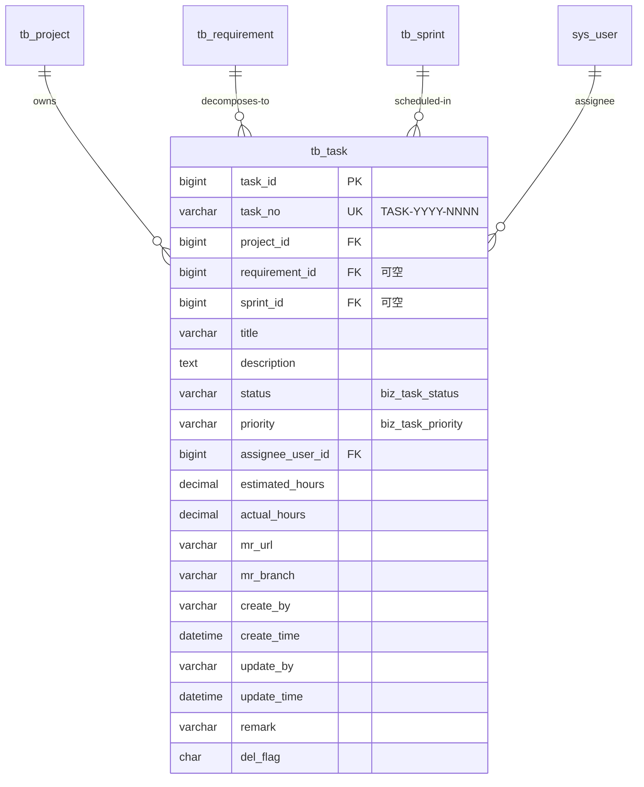

# Task 模块 — 数据库设计

| 字段 | 值 |
|---|---|
| 版本 | v1.0 |
| 关联 PRD | [Task-PRD.md](../01-立项/Task-PRD.md) §3.1 |
| 关联 ADR | ADR-0003 草案 (TASK-YYYY-NNNN 编号规则) |
| DBA review | Wjl ✅ (solo) |
| 菜单 ID 段 | 2030-2037 (业务管理 2000 下挂二级 任务管理 2030 + 7 按钮) |

## 1. ER 图



## 2. DDL 草案

```sql
-- ============================================================
-- Task 业务表 (tb_task) — v1.0
-- ============================================================
DROP TABLE IF EXISTS tb_task;
CREATE TABLE tb_task (
    task_id           BIGINT(20)    NOT NULL AUTO_INCREMENT  COMMENT '主键',
    task_no           VARCHAR(32)   NOT NULL                 COMMENT '任务编号 TASK-YYYY-NNNN;ADR-0003',
    project_id        BIGINT(20)    NOT NULL                 COMMENT '所属项目 FK→tb_project',
    requirement_id    BIGINT(20)    DEFAULT NULL             COMMENT '关联需求 FK→tb_requirement(可空)',
    sprint_id         BIGINT(20)    DEFAULT NULL             COMMENT '关联迭代 FK→tb_sprint(可空)',
    title             VARCHAR(200)  NOT NULL                 COMMENT '任务标题',
    description       TEXT                                   COMMENT '详细描述',
    status            VARCHAR(2)    NOT NULL DEFAULT '00'    COMMENT '状态(字典 biz_task_status)',
    priority          VARCHAR(2)    NOT NULL DEFAULT '02'    COMMENT '优先级(字典 biz_task_priority)',
    assignee_user_id  BIGINT(20)    DEFAULT NULL             COMMENT '负责人 FK→sys_user',
    estimated_hours   DECIMAL(5, 1) DEFAULT NULL             COMMENT '预估工时(小时)',
    actual_hours      DECIMAL(5, 1) DEFAULT NULL             COMMENT '实际工时(状态进入「已完成」时填)',
    mr_url            VARCHAR(500)  DEFAULT NULL             COMMENT '关联 MR/PR 链接',
    mr_branch         VARCHAR(100)  DEFAULT NULL             COMMENT 'MR 分支名',
    create_by         VARCHAR(64)   DEFAULT ''               COMMENT '创建者',
    create_time       DATETIME      DEFAULT NULL             COMMENT '创建时间',
    update_by         VARCHAR(64)   DEFAULT ''               COMMENT '更新者',
    update_time       DATETIME      DEFAULT NULL             COMMENT '更新时间',
    remark            VARCHAR(500)  DEFAULT ''               COMMENT '备注',
    del_flag          CHAR(1)       DEFAULT '0'              COMMENT '0=正常 2=删除',
    PRIMARY KEY (task_id),
    UNIQUE KEY uk_task_no (task_no),
    KEY idx_task_project (project_id),
    KEY idx_task_requirement (requirement_id),
    KEY idx_task_sprint (sprint_id),
    KEY idx_task_assignee (assignee_user_id),
    KEY idx_task_status_priority (status, priority)
) ENGINE=InnoDB AUTO_INCREMENT=1 DEFAULT CHARSET=utf8mb4 COMMENT='任务(Task)';

-- ============================================================
-- 字典类型 (2 个)
-- ============================================================
INSERT INTO sys_dict_type (dict_name, dict_type, status, create_by, create_time, remark) VALUES
('任务状态',   'biz_task_status',   '0', 'admin', SYSDATE(), '任务 6 状态机'),
('任务优先级', 'biz_task_priority', '0', 'admin', SYSDATE(), '任务优先级 P0/P1/P2');

-- ============================================================
-- 字典数据 (6 + 3 = 9 条)
-- ============================================================
-- 状态 (6 个,与 PRD §3.3 6×6 状态机一致)
INSERT INTO sys_dict_data (dict_sort, dict_label, dict_value, dict_type, css_class, list_class, is_default, status, create_by, create_time, remark) VALUES
(1, '待开发',   '00', 'biz_task_status', '', 'info',    'Y', '0', 'admin', SYSDATE(), ''),
(2, '开发中',   '01', 'biz_task_status', '', 'primary', 'N', '0', 'admin', SYSDATE(), ''),
(3, '代码评审', '02', 'biz_task_status', '', 'warning', 'N', '0', 'admin', SYSDATE(), ''),
(4, '测试中',   '03', 'biz_task_status', '', 'warning', 'N', '0', 'admin', SYSDATE(), ''),
(5, '已完成',   '04', 'biz_task_status', '', 'success', 'N', '0', 'admin', SYSDATE(), '终态'),
(6, '已取消',   '05', 'biz_task_status', '', 'danger',  'N', '0', 'admin', SYSDATE(), '终态');

-- 优先级
INSERT INTO sys_dict_data (dict_sort, dict_label, dict_value, dict_type, css_class, list_class, is_default, status, create_by, create_time, remark) VALUES
(1, 'P0 紧急', '00', 'biz_task_priority', '', 'danger',  'N', '0', 'admin', SYSDATE(), ''),
(2, 'P1 重要', '01', 'biz_task_priority', '', 'warning', 'N', '0', 'admin', SYSDATE(), ''),
(3, 'P2 一般', '02', 'biz_task_priority', '', 'info',    'Y', '0', 'admin', SYSDATE(), '');

-- ============================================================
-- 菜单与权限 (菜单 ID 2030-2037,挂在业务管理 2000 下)
-- ============================================================
INSERT INTO sys_menu VALUES
(2030, '任务管理', 2000, 3, 'task',           'business/task/index',         '', '', 1, 0, 'C', '0', '0', 'business:task:list',   'list',   'admin', SYSDATE(), '', NULL, '任务管理菜单'),
(2031, '任务查询', 2030, 1, '#',              '',                            '', '', 1, 0, 'F', '0', '0', 'business:task:query',  '#',      'admin', SYSDATE(), '', NULL, ''),
(2032, '任务新增', 2030, 2, '#',              '',                            '', '', 1, 0, 'F', '0', '0', 'business:task:add',    '#',      'admin', SYSDATE(), '', NULL, ''),
(2033, '任务修改', 2030, 3, '#',              '',                            '', '', 1, 0, 'F', '0', '0', 'business:task:edit',   '#',      'admin', SYSDATE(), '', NULL, ''),
(2034, '任务删除', 2030, 4, '#',              '',                            '', '', 1, 0, 'F', '0', '0', 'business:task:remove', '#',      'admin', SYSDATE(), '', NULL, ''),
(2035, '任务导出', 2030, 5, '#',              '',                            '', '', 1, 0, 'F', '0', '0', 'business:task:export', '#',      'admin', SYSDATE(), '', NULL, ''),
(2036, '任务看板', 2000, 4, 'taskkanban',     'business/task/kanban',        '', '', 1, 0, 'C', '0', '0', 'business:task:kanban', 'tree',   'admin', SYSDATE(), '', NULL, '看板视图(只读)'),
(2037, '我的任务', 0,    8, 'mytask',         'business/task/my',            '', '', 1, 0, 'C', '0', '0', 'business:task:list',   'people', 'admin', SYSDATE(), '', NULL, '一级菜单,顶级);

-- admin 角色全量授权 (8 条)
INSERT INTO sys_role_menu VALUES (1, 2030), (1, 2031), (1, 2032), (1, 2033), (1, 2034), (1, 2035), (1, 2036), (1, 2037);
```

> **2037 我的任务挂顶级菜单**: 为了快速访问"我的任务"页,作为一级菜单单独显示;同时复用 `business:task:list` 权限,无新权限点。

## 3. 索引策略

| 索引 | 列 | 用途 |
|---|---|---|
| `PRIMARY` | `task_id` | 主键 |
| `uk_task_no` | `task_no` | 编号唯一 |
| `idx_task_project` | `project_id` | 项目下任务列表(高频) |
| `idx_task_requirement` | `requirement_id` | 需求详情下的任务列表 |
| `idx_task_sprint` | `sprint_id` | **看板查询关键索引** |
| `idx_task_assignee` | `assignee_user_id` | 我的任务 (高频) |
| `idx_task_status_priority` | (status, priority) | 看板列分组 + P0/P1 紧急筛选 |

> 比 Requirement 多 1 个组合索引,因 Task 是高频读 + 看板查询性能要求 < 800ms(PRD §4)。Phase 03 必须 EXPLAIN 验证 idx_task_sprint 是否走对。

## 4. 命名规范

- ✅ 主键命名 `task_id` (沿用 Requirement 模式 `<table>_id`)
- ✅ 表前缀 `tb_`,字典前缀 `biz_task_*`,索引前缀 `idx_task_*`
- ✅ 通用 6 字段

## 5. 迁移方案

**脚本**:`plm-backend/sql/business-task.sql`

**回滚**:
```sql
DELETE FROM sys_role_menu WHERE menu_id BETWEEN 2030 AND 2037;
DELETE FROM sys_menu WHERE menu_id BETWEEN 2030 AND 2037;
DELETE FROM sys_dict_data WHERE dict_type IN ('biz_task_status', 'biz_task_priority');
DELETE FROM sys_dict_type WHERE dict_type IN ('biz_task_status', 'biz_task_priority');
DROP TABLE IF EXISTS tb_task;
```

## 6. Phase 03 实施清单

- [ ] 用 ruoyi-bootstrap skill Phase 7 生成 Task 模板(注意是**第 3 个**模块,SR-T-S 依赖排序的中间环)
- [ ] DDL 执行 + 9 字典数据可见 + 8 菜单可见
- [ ] 6×6 状态机单测覆盖(36 case;允许 ✅ + 禁止 ❌)
- [ ] 看板视图 `idx_task_sprint` EXPLAIN 验证(目标 type=ref / Extra=Using where)
- [ ] **FK 校验补充测试**: 关联不存在的 requirement_id / sprint_id 返回 702

## 7. 变更记录

| 版本 | 日期 | 变更 |
|---|---|---|
| v1.0 | 2026-05-16 | 初版 |
