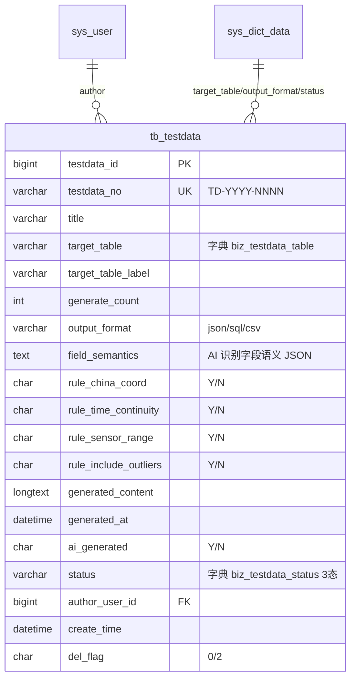

# Testdata 模块 — 数据库设计 (骨架)

| 字段 | 值 |
|---|---|
| 版本 | v1.0-skeleton (派生于 commit b158d2f / 2026-05-17) |
| 关联 PRD | [Testdata-PRD.md](../01-立项/Testdata-PRD.md) |
| 表 | `tb_testdata` |
| 编号规则 | `TD-YYYY-NNNN` |
| 完整 DDL | [plm-backend/sql/business-testdata.sql](../plm-backend/sql/business-testdata.sql) |
| DBA review | Wjl ✅ (solo) |

## 1. 字段对照表

**单一事实来源**: [PRD-MAPPING.md §2 "Testdata"](../PRD-MAPPING.md)。本文件**不重复字段表**,字段定义任何 drift 修复走 §M.2 流程。

## 2. 状态机字典

见 [PRD-MAPPING.md §3 状态机汇总](../PRD-MAPPING.md) 的 `testdata` 行;SQL 字典数据见 SQL 文件 `sys_dict_data` 段。

## 3. 索引设计

详见 SQL 文件 `PRIMARY KEY` / `UNIQUE KEY` / `KEY` 定义。

## 4. 关系图 (ER)

## 5. 数据迁移
dev 环境:`mysql plm < sql/business-testdata-rollback.sql && mysql plm < sql/business-testdata.sql`。
生产部署:留 v1.0 GA 前补。

## 6. 容量预估

**分级**: 中规模(质量/数据类)。按 5 个项目 × 20 数据集/项目 × 平均 1000 条/数据集 = 单数据集元数据 100 行/年(数据本身存 LONGTEXT)。5 年累计 < 5000 行元数据。`generated_content` LONGTEXT 单行可达 1-10MB(海量样本数据),需关注 `status='02' 已归档` 后冷数据迁移(>2 年清空 content,保留元数据)。索引覆盖 target_table / status / author_user_id。
