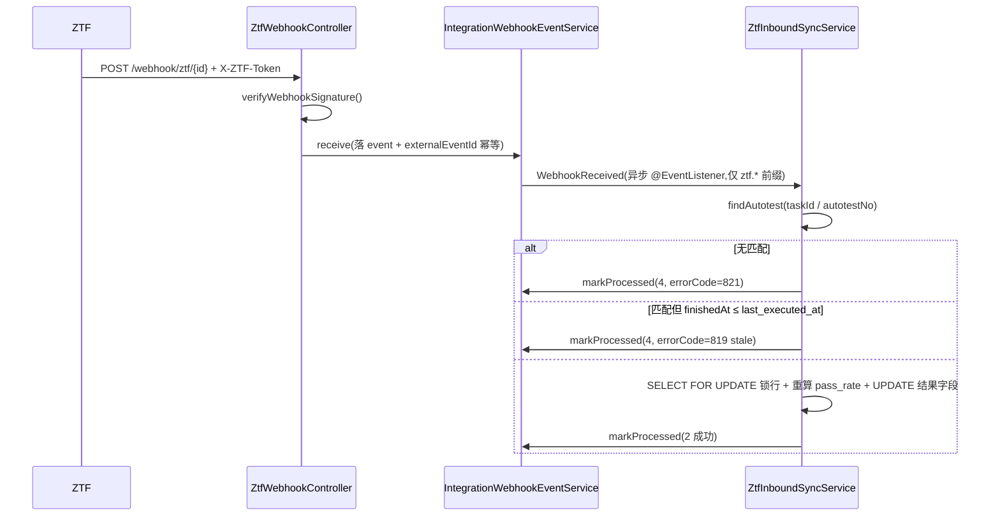

# ZTF自动化测试框架(Ztf)集成 — 系统/API/数据库 设计文档

> 模块:`plm-integration`(`adapter/ztf/`)
> 关联 Proposal:[0019 integration-connector skill](../99-跨阶段/proposals/0019-integration-connector-skill.md)（**本连接器是该 skill 的首次 pilot**;若后续扩双向/扩资源再单独立 proposal）
> 父设计文档:[02-设计/MCP-集成-设计.md](MCP-集成-设计.md)(共用 ConnectorAdapter / 通用表 / 加密)
> 关联 SSoT:[PRD-MAPPING.md](../PRD-MAPPING.md) `biz_integration_type` = …/**ztf** / 已建 feishu·gitlab·zentao
> 范式来源:`adapter/zentao/`(第 4 个 ConnectorAdapter;但 ZTF 是**单向**,与禅道双向不同 — 见 §0)

---

## 0. 关键差异:ZTF 是**单向 Inbound**,不是双向(pilot 重要结论)

ZTF(ZenTao Test Framework)是**自动化测试执行框架**:跑测试脚本 → 产出执行结果(通过/失败数、耗时、根因)。它是"执行平台"而非"工单系统",数据天然**只从 ZTF 流入 PLM**(执行结果回传),PLM 不回写 ZTF。因此本连接器:

| 维度 | 禅道(双向) | **ZTF(本连接器,单向 Inbound)** |
|---|---|---|
| 方向 | Inbound + Outbound | **仅 Inbound**(ZTF 跑完 → 回传结果 → 更新 tb_autotest) |
| Outbound Service | 有 | **无**(PLM 不推数据回 ZTF) |
| 业务 ServiceImpl publishEvent(Phase 6)| 4 模块插钩子 | **不需要**(无 Outbound 消费方) |
| **防回环三道防线** | **核心** | **不适用** —— 单向无 `A→B→A` 回环,`SyncContext`/`recentSyncCache`/出站 LWW **全部省去** |
| 仍需保留 | — | **幂等**(externalEventId + `(external_source,external_id)` 唯一索引)+ **入站 last-write-wins**(新 run 覆盖旧 run,旧 run 重发跳过)|
| 映射目标 | status 状态机 | **结果字段**(passed/failed/pass_rate/duration),**不改 tb_autotest.status 生命周期** |

> 📌 **skill pilot 反馈(0019 tracking)**:`integration-connector` skill 模板默认双向,本次 pilot 暴露"单向 Inbound 连接器"是一类未被模板显式覆盖的形态 —— 应把 OutboundSyncService / 业务 Event 钩子 / 防回环三道防线标为"双向专属,单向跳过"。已在本设计 §0 显式裁剪;建议回写 skill SKILL.md Phase 0 step 2 增"单向 Inbound 形态"分支说明。

---

## 1. 范围与边界

### 1.1 包含
- 新增 `connector_type=ztf` 适配器:`ZtfConnectorAdapter`(ping/验签/凭据解密/拉取 run 详情)、`ZtfWebhookController`(入站 + 验签 + 幂等)、`ZtfInboundSyncService`(结果回写 tb_autotest)。
- DDL:`tb_autotest` 加 `external_source / external_id / external_url` + 唯一索引;字典补 `biz_integration_type` 增 `ztf`。
- 入站:ZTF run 完成 webhook → 匹配 tb_autotest(external_id=ZTF taskId,或 autotest_no)→ 更新执行结果字段(total/passed/failed/pass_rate/duration/last_executed_at/root_cause)。
- 冲突合并:**入站 last-write-wins**(以 ZTF run 的完成时间比 `last_executed_at`,旧 run 重发跳过)。

### 1.2 不包含(本期)
- ❌ **Outbound**(PLM → ZTF):v0.x 不做;若需"PLM 触发 ZTF 跑测试",那是命令调用(单独 API),不是实体双向同步,留 v0.2 评估。
- ❌ **逐用例结果 → tb_testcase**:本期只回写套件级(tb_autotest)聚合结果;per-case 落 tb_testcase 留 v0.2。
- ❌ 改 tb_autotest.status 生命周期(00 草稿/01 激活/02 禁用 是 PLM 侧管理态,ZTF 不碰)。
- ❌ 前端 UI(本期只做表 + Service;结果在既有 autotest 详情页展示已有字段,无需新菜单)→ **不发 user-mapping sys_menu**(避免反思 O8 指向虚空的菜单)。

---

## 2. C4 组件图(Container 级别)

```
┌─ ZTF自动化测试框架(外部)────────────────────────────┐
│  跑测试脚本 → run 完成 → Webhook 出站(X-ZTF-Token 验签)│
└──────────────────────┬────────────────────────────────┘
                       │ Webhook 入站(单向)
┌──────────────────────▼────────────────────────────────┐
│ plm-admin → plm-integration/adapter/ztf                │
│  ZtfWebhookController  →(WebhookReceived 事件)→         │
│  ZtfInboundSyncService ──直写 tb_autotest 结果字段──→    │
│  ZtfConnectorAdapter(被 Inbound 调,出站 GET 拉 run 详情/ping)│
└──────────────────────────────────────────────────────────┘
依赖:plm-integration → plm-common(WebhookReceived 事件)+ plm-system + tb_autotest。
**无** OutboundSyncService、**无** 业务模块 publishEvent(单向特性)。
```

---

## 3. 数据库设计

### 3.1 ALTER tb_autotest 加 external_* 列
```sql
ALTER TABLE tb_autotest
    ADD COLUMN external_source VARCHAR(32)  DEFAULT NULL COMMENT '外部来源(ztf),NULL=非外部同步',
    ADD COLUMN external_id     VARCHAR(64)  DEFAULT NULL COMMENT 'ZTF 任务/run id,NULL=未关联',
    ADD COLUMN external_url    VARCHAR(512) DEFAULT NULL COMMENT 'ZTF run 详情 url',
    ADD UNIQUE KEY uk_autotest_external (external_source, external_id);
```
> ⚠ 两列 `DEFAULT NULL`(非 `DEFAULT ''`):MySQL 唯一索引中任一列 NULL 不参与唯一约束 —— 大量未关联 ZTF 的 autotest 行(两列 NULL)可共存,只对真正绑定了 ZTF taskId 的行做幂等(反思 O9)。

### 3.2 字典补充
| 字典 type | label / value | 说明 |
|---|---|---|
| `biz_integration_type`(已存在,追加一项)| "ZTF" / `ztf` | 连接器类型 |

> 不新增 `biz_autotest_status` 的 `99`:ZTF 不改生命周期 status,只写结果字段,无"未识别外部状态"问题。

完整 DDL 见 `plm-backend/sql/business-integration-ztf.sql`。

---

## 4. 字段映射(ZTF run 结果 → tb_autotest)

### 4.1 ZTF run-complete ↔ tb_autotest(执行结果字段,**只更新不新建**)
| ZTF 字段 | tb_autotest 字段 | 备注 |
|---|---|---|
| `taskId` / `runId` | `external_id` | 匹配键(external_source='ztf')|
| `total` | `total_cases` | 用例总数 |
| `pass` | `passed_cases` | 通过数 |
| `fail` + `error` + `blocked` | `failed_cases` | 非通过合并计失败 |
| 计算 `pass/total*100` | `pass_rate` | 服务端重算,不信任外部传入 |
| `duration`(秒)| `execution_duration_sec` | |
| `finishedAt` | `last_executed_at` | **last-write-wins 比对键** |
| `failureSummary` / AI 根因 | `last_root_cause_analysis` | 去 HTML + 截断;可空 |
| `runUrl` | `external_url` | ZTF run 详情页 |
| `executor`(account) | (用户映射,可选,本期容忍 null) | — |

> **匹配策略**:webhook payload 必带 `autotestNo`(ZTF 侧配置时填 PLM 的 AT-YYYY-NNNN)或 `taskId`。Inbound 先按 `(external_source='ztf', external_id=taskId)` 查;查不到则按 `autotest_no` 查并回填 external_id(首次绑定);两者都查不到 → markProcessed(4, errorCode=821 无匹配套件),不新建(本期不自动建套件)。

---

## 5. 状态机映射

**N/A** —— ZTF 不改 tb_autotest.status(PLM 生命周期态)。ZTF 只更新执行**结果字段**。这是与禅道(映射 status 状态机)的根本不同,本连接器无状态机映射表。

---

## 6. 冲突合并(入站 last-write-wins,单向无回环)

### 6.1 决策表
| 场景 | tb_autotest `last_executed_at` | ZTF `finishedAt`(payload) | 决策 |
|---|---|---|---|
| 入站 run 结果 | `T_PLM` | `T_X` | `T_X > T_PLM`(或 PLM 为 NULL)→ 覆盖结果字段;否则跳过(stale,errorCode 819,旧 run 重发)|
| 同一时刻 tie | tie | tie | 外部赢(ZTF 是结果的唯一权威)|

### 6.2 防回环
**不适用** —— 单向 Inbound 不存在 `A→B→A` 回环(PLM 不回写 ZTF)。`SyncContext` / `recentSyncCache` / 出站 LWW **本连接器不实现**。仅保留:
- **幂等**:`externalEventId`(webhook 带,毫秒级重发去重)+ `(external_source, external_id)` 唯一索引。
- **入站 LWW**:`SELECT ... FOR UPDATE` 锁 tb_autotest 行 + `last_executed_at` 比对(防旧 run 乱序到达覆盖新结果)。

---

## 7. 用户映射
本期 **容忍 null**:ZTF `executor.account` 暂不强制映射 sys_user(autotest 结果不挂执行人也可用)。`tb_integration_user_mapping` 本连接器不建。v0.2 若要展示"谁触发的 run"再加。

---

## 8. API 契约

### 8.1 ZTF 侧 endpoint(出站调用,仅用于 ping / 拉 run 详情)
| Endpoint | Method | 用途 |
|---|---|---|
| `/api/v1/tokens` 或 ZTF 配置的鉴权端点 | POST `{account,password}` | 取 token(ping 用)|
| `/api/v1/tasks/{taskId}` | GET | 拉 run 详情(补全 payload 缺失字段时)|

### 8.2 PLM 侧端点
| Endpoint | Method | 权限 | 说明 |
|---|---|---|---|
| `/integration/webhook/ztf/{connectorId}` | POST | 公开 + 验签(`@Anonymous`)| ZTF run 完成回调 |
| `/business/integration/connector/{id}/test` | POST | `business:integration:connector:test`(已存在)| 调 ZtfAdapter.ping |

---

## 9. Webhook payload 示例(ZTF run 完成)
```json
{
  "event": "run.completed",
  "taskId": 4521,
  "autotestNo": "AT-2026-0007",
  "total": 48, "pass": 45, "fail": 2, "error": 1, "blocked": 0,
  "duration": 312,
  "finishedAt": "2026-05-27 14:30:12",
  "executor": "ztf-runner",
  "failureSummary": "2 UI 用例超时,1 API 断言失败",
  "runUrl": "https://ztf.example.com/run/4521"
}
```
`event_type` 落库格式:`ztf.run.<event>`(如 `ztf.run.completed`)。

---

## 10. 错误码
| 码 | 含义 | 场景 |
|---|---|---|
| 805 | connector 配置缺 | connector 不存在/停用/type≠ztf |
| 813 | token 失败 | ping 时 account/password 错 |
| 814 | endpoint 不可达 | ping 网络/DNS |
| 815 | webhook 验签失败 | X-ZTF-Token 不匹配 → 401 + process_status=4 |
| 819 | 冲突:ZTF run stale | `finishedAt ≤ last_executed_at`(旧 run 重发)|
| **821** | **无匹配 autotest 套件** | taskId/autotestNo 都查不到 → markProcessed(4),不自动建套件(本期范围)|

> **821 为本连接器新增** —— 已在 PRD-MAPPING §错误码表登记(见 §15 修订附带动作)。其余复用既有码。

---

## 11. 时序图(仅入站 — 单向)


> 无出站时序图(单向)。

---

## 12. 安全模型
继承 [MCP-集成-设计.md §4](MCP-集成-设计.md):凭据 `AES-256-GCM(JSON(credential), MCP_ENCRYPT_KEY)`;token 缓存手搓 `ConcurrentHashMap`+TTL(非 Caffeine 库,功能等价);webhook 验签 `X-ZTF-Token` 与 `connector.webhook_secret` 常量时间比对,失败 401 + `process_status=4`;公网 IP 白名单走 nginx。

---

## 13. 部署 & 配置
环境变量沿用 `MCP_ENCRYPT_KEY`,无新增。

ZTF 侧 webhook 配置:
```
URL:    https://plm.example.com/dev-api/integration/webhook/ztf/{connectorId}
Method: POST
密钥:   填 connector.webhook_secret(发到 X-ZTF-Token header)
事件:   run.completed
payload: 须含 taskId + (autotestNo 或可由 taskId 反查) + total/pass/fail/duration/finishedAt
```
PLM 侧 connector 配置:
```yaml
connectorType: ztf
endpoint:      https://ztf.example.com   # 不带末尾斜杠(ping 用)
credentialEnc: AES_GCM({"account":"plm-bot","password":"xxxxx"})
webhookSecret: <随机 32 字节>
configJson: { }   # 单向无 outboundFields / 无 productProjectMap
```

---

## 14. 验收与测试
| 维度 | 验收 |
|---|---|
| 单元测试(3 份,**无 Outbound test** — 单向)| `ZtfConnectorAdapterTest`(ping 200/401,type()=ztf,token 缓存命中,验签 ok/fail)/ `ZtfWebhookControllerTest`(验签 ok/fail + externalEventId 幂等)/ `ZtfInboundSyncServiceTest`(payload 映射 + pass_rate 重算 + stale 跳过 819 + 无匹配 821)|
| 集成测试 | MockServer 模拟 ZTF ping;H2 跑 Inbound 落库 |
| 端到端 | 真实 ZTF + 测试套件:ZTF 跑完 → PLM tb_autotest 结果字段更新;旧 run 重发 → 跳过(819);幂等 run 重发 → 不重复处理 |
| Gate | Phase 02(设计/DDL)+ Phase 03(集成)各一份签字(L1)|

> ⚠ 单向无"防循环验证"用例(§3.4 双向专属);本连接器端到端重点是 **幂等 + 旧 run stale 跳过**。诚实标注:测试写了几份就是几份,不在 Gate 勾未写的(反思 O4)。

---

## 15. 修订
| 日期 | 修改人 | 改了什么 |
|---|---|---|
| 2026-05-27 | Wjl + Claude | 初版 — integration-connector skill 首次 pilot(ZTF 单向 Inbound);§0 记录"单向形态"对 skill 模板的裁剪 + pilot 反馈;新增错误码 821(待登记 PRD-MAPPING §M.5)|
