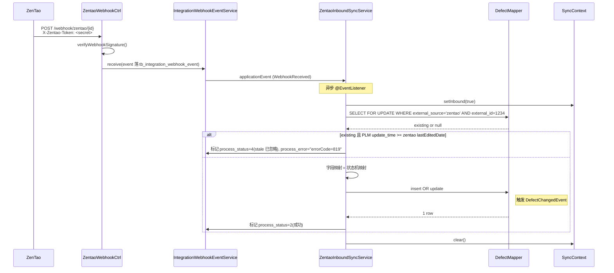
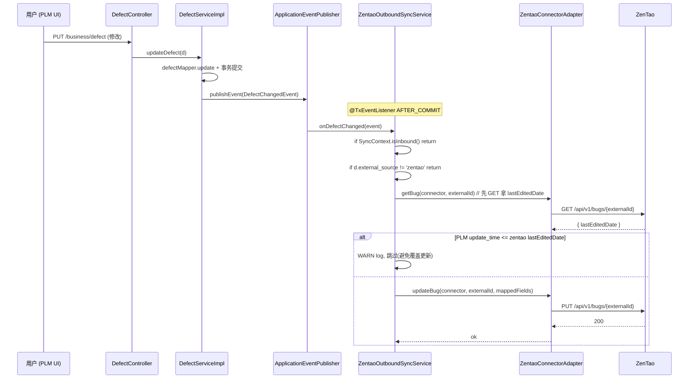

# 禅道(ZenTao)集成 — 系统/API/数据库 设计文档

> 模块:`plm-integration`(`adapter/zentao/`)
> 关联 Proposal:[0014](../99-跨阶段/proposals/0014-zentao-bidirectional-sync.md)、[0007](../99-跨阶段/proposals/0007-mcp-integration-modules-uplift.md)
> 父设计文档:[02-设计/MCP-集成-设计.md](MCP-集成-设计.md)(共用 ConnectorAdapter / 通用表 / 加密)
> 关联 SSoT:[PRD-MAPPING.md §33.1 Zentao 子映射](../PRD-MAPPING.md)

---

## 1. 范围与边界

### 1.1 包含

- 在 plm-integration 模块新增 connector_type=`zentao` 的适配器:
    - `ZentaoConnectorAdapter` — ping / 验签 / token 缓存 / 4 类资源(bug/story/task/case)CRUD
    - `ZentaoWebhookController` — 入站 `/integration/webhook/zentao/{connectorId}` + X-Zentao-Token 验签
    - `ZentaoInboundSyncService` — 禅道 → PLM 入站同步(消费 webhook 事件)
    - `ZentaoOutboundSyncService` — PLM → 禅道 出站同步(消费业务 ApplicationEvent)
- DDL:在 tb_defect / tb_requirement / tb_task / tb_testcase 加 `external_source / external_id / external_url`,新表 `tb_integration_user_mapping`
- 4 个业务模块(plm-defect / plm-requirement / plm-task / plm-testcase)在 ServiceImpl 写入成功后 publishEvent
- 冲突合并策略:**last-write-wins**(基于 `update_time` 比对)+ 60s 防抖
- 用户映射:`zentao.account` ↔ `sys_user.user_name`,缺映射时容忍

### 1.2 不包含

- 禅道 v15- 老 sessionID 流派(只支持 v18+ REST `/api/v1/`)
- 双向同步附件(只同步主表字段;附件留 v0.6+)
- 禅道里的 Product / Project / Release / Build 同步(本期只做 4 个工单类资源)
- 工作流(workflow)/审批同步
- 用户头像 / 部门 / 角色 同步(只做 account ↔ user_name 二元映射)

---

## 2. C4 组件图(Container 级别)

```
┌──────────────────────────────────────────────────────────────────────┐
│  禅道 (外部, v18+)                                                    │
│  ┌──────────────────────────────────────────────────────────────┐    │
│  │  REST API /api/v1/{tokens, products, projects, executions,   │    │
│  │   bugs, stories, tasks, testcases}                            │    │
│  │  Webhook 出站(自定义 header X-Zentao-Token)                  │    │
│  └────────┬───────────────────────────┬──────────────────────────┘    │
└───────────┼───────────────────────────┼───────────────────────────────┘
            │ Webhook 入站              │ REST 出站调用
┌───────────▼───────────────────────────▼───────────────────────────────┐
│ plm-admin (8081)                                                       │
│                                                                        │
│ ┌────────────────────────────────────────────────────────────────┐    │
│ │              plm-integration / adapter / zentao                │    │
│ │ ┌──────────────────────┐  ┌─────────────────────────────────┐  │    │
│ │ │ ZentaoWebhookCtrl    │  │ ZentaoConnectorAdapter          │  │    │
│ │ │ POST /integration/   │  │ - type() = "zentao"             │  │    │
│ │ │  webhook/zentao/{id} │  │ - ping() / verifyWebhookSig()   │  │    │
│ │ │ + 验签 + 落 event 表 │  │ - getToken() (Caffeine 25min)   │  │    │
│ │ └─────────┬────────────┘  │ - list/create/update Bug/...    │  │    │
│ │           │ EventListener │ - Credential JSON: {acct, pwd}  │  │    │
│ │           ▼               └────────▲────────────────────────┘  │    │
│ │ ┌──────────────────────┐           │ 调                        │    │
│ │ │ ZentaoInboundSyncSvc │           │                           │    │
│ │ │ - syncBug/Story/...  │───────────┼───────────────────────┐   │    │
│ │ │ - 映射 + 防循环      │           │                       │   │    │
│ │ └─────────┬────────────┘           │                       │   │    │
│ └───────────┼─────────────────────────│───────────────────────│───┘    │
│             │ 直写业务表(via Mapper) │                       │        │
│             │                         │                       │        │
│             │     ┌───────────────────┴──────────────────┐    │        │
│             │     │ ZentaoOutboundSyncService            │    │        │
│             │     │ - @TxEventListener AFTER_COMMIT     │    │        │
│             │     │ - 监听 DefectChangedEvent 等        │    │        │
│             │     │ - 检查 SyncContext.inbound 防循环   │    │        │
│             │     └─────────────────▲────────────────────┘    │        │
│             │                       │                          │        │
│             │     ┌─────────────────┴─────────────────────┐    │        │
│             ▼     │ plm-defect / plm-requirement /        │    │        │
│  ┌──────────────┐ │ plm-task / plm-testcase 的 ServiceImpl│    │        │
│  │ MySQL plm DB │ │ insert/update/delete → publishEvent   │    │        │
│  └──────────────┘ └────────────────────────────────────────┘    │        │
└────────────────────────────────────────────────────────────────────────┘
```

依赖方向:
- `plm-integration` → `plm-common`(Event DTO)+ `plm-system`(SecurityUtils)+ `plm-defect/...`(Mapper 写业务表)
- `plm-defect/...` → `plm-common`(Event DTO)+ ApplicationContext(发 Event)

---

## 3. 数据库设计

### 3.1 ALTER:4 个业务表加 external_* 列

```sql
-- 缺陷
ALTER TABLE tb_defect
    ADD COLUMN external_source VARCHAR(32)  DEFAULT '' COMMENT '外部来源(zentao/jira)' AFTER del_flag,
    ADD COLUMN external_id     VARCHAR(64)  DEFAULT '' COMMENT '外部主键 id' AFTER external_source,
    ADD COLUMN external_url    VARCHAR(512) DEFAULT '' COMMENT '外部详情 url' AFTER external_id,
    ADD UNIQUE KEY uk_defect_external (external_source, external_id);

-- 需求 / 任务 / 用例 同上(只列结构差异)
ALTER TABLE tb_requirement ADD ... ADD UNIQUE KEY uk_req_external (external_source, external_id);
ALTER TABLE tb_task        ADD ... ADD UNIQUE KEY uk_task_external (external_source, external_id);
ALTER TABLE tb_testcase    ADD ... ADD UNIQUE KEY uk_tc_external (external_source, external_id);
```

> 注:`external_id=''` 多行**不**违反唯一索引(MySQL 唯一索引允许多个空值/NULL,但 `''` 视为同值会冲突)— 因此用 `DEFAULT ''` + 仅在同步落库时填值;手工新建的行 external_id 留空,索引不约束。这是约定:**`external_source` 也为 `''` 时,external_id `''` 视为无对照,不强制唯一**。

实际唯一索引设为 `(external_source, external_id)` 两列联合,且**所有未同步行 external_source 留 `''`**,因此 `('','')` 多行存在 — MySQL 唯一索引中 `('','')` 是同一值,会冲突。

🚨 **修正**:索引改为 **`(external_source, external_id)` 并要求 external_source 非空才生效**:

```sql
ALTER TABLE tb_defect
    ADD COLUMN external_source VARCHAR(32)  DEFAULT NULL COMMENT '外部来源(zentao/jira),NULL=未同步',
    ADD COLUMN external_id     VARCHAR(64)  DEFAULT NULL COMMENT '外部主键 id,NULL=未同步',
    ADD COLUMN external_url    VARCHAR(512) DEFAULT NULL COMMENT '外部详情 url',
    ADD UNIQUE KEY uk_defect_external (external_source, external_id);
```

MySQL 唯一索引中**任一列 NULL 都不参与唯一约束**,因此未同步行(两列都 NULL)可共存,只对真正同步过的行做幂等约束。

### 3.2 新表:用户映射

```sql
CREATE TABLE tb_integration_user_mapping (
    id                  BIGINT(20)   NOT NULL AUTO_INCREMENT COMMENT '主键',
    connector_id        BIGINT(20)   NOT NULL                COMMENT 'FK→tb_integration_connector.id',
    external_account    VARCHAR(64)  NOT NULL                COMMENT '外部账号(禅道 account)',
    user_id             BIGINT(20)   DEFAULT NULL            COMMENT 'PLM sys_user.user_id,NULL=未映射,容忍',
    sync_direction      VARCHAR(16)  DEFAULT 'both'          COMMENT 'inbound/outbound/both',
    last_used_at        DATETIME     DEFAULT NULL            COMMENT '最近使用',
    create_by VARCHAR(64) DEFAULT '', create_time DATETIME DEFAULT NULL,
    update_by VARCHAR(64) DEFAULT '', update_time DATETIME DEFAULT NULL,
    remark VARCHAR(500) DEFAULT '',
    PRIMARY KEY (id),
    UNIQUE KEY uk_user_map (connector_id, external_account),
    KEY idx_user_map_user (user_id)
) ENGINE=InnoDB DEFAULT CHARSET=utf8mb4 COMMENT='集成用户映射';
```

### 3.3 字典补充

| 字典 type | label / value | 说明 |
|---|---|---|
| `biz_defect_status` | "外部同步" / `99` | 兜底未识别的外部状态 |
| `biz_req_status` | "外部同步" / `99` | 同上 |
| `biz_zentao_severity` | 1=Blocker / 2=Critical / 3=Major / 4=Minor | 反查映射展示用(可选) |
| `biz_zentao_pri` | 1-4 | 同上 |
| `biz_integration_user_dir` | `inbound`/`outbound`/`both` | 同步方向 |

完整 DDL 见 [plm-backend/sql/business-integration-zentao.sql](../plm-backend/sql/business-integration-zentao.sql)。

---

## 4. 字段映射(详细)

### 4.1 禅道 Bug ↔ PLM Defect (`tb_defect`)

| 禅道字段(/api/v1/bugs/{id}) | PLM 字段 | 备注 |
|---|---|---|
| `id` | `external_id` | 数字主键 |
| `title` | `title` | 直映射 |
| `steps` (HTML) | `description` | 去 HTML 标签;长度 4000 截断 |
| `severity` (1-4) | `severity` (字典 biz_defect_severity) | 1→Blocker(`0`) 2→Critical(`1`) 3→Major(`2`) 4→Minor(`3`) |
| `pri` (1-4) | `priority` (字典 biz_defect_priority) | 同上,直数字映射 |
| `status` (active/resolved/closed) | `status` | active→`1`新建 resolved→`2`已解决 closed→`3`已关闭 未识别→`99` |
| `openedBy` (account) | `reporter` | 通过 tb_integration_user_mapping 查 user_name,缺映射存 account 原值 |
| `assignedTo` (account) | `assignee` | 同上 |
| `product` (id) | `projectId` | 需要 product↔project 映射(本期通过 connector.config_json.productProjectMap = {productId: plmProjectId} 配置,缺则报错落 process_error) |
| `openedDate` | `createTime` | UTC→Asia/Shanghai |
| `lastEditedDate` | (用于冲突比较,**不写 update_time**) | 写入时 PLM 自己的 update_time 由 MyBatis 自动维护 |
| (禅道 URL) | `external_url` | 拼接 `{endpoint}/zentao/bug-view-{id}.html` |

### 4.2 禅道 Story ↔ PLM Requirement (`tb_requirement`)

| 禅道字段 | PLM 字段 | 备注 |
|---|---|---|
| `id` | `external_id` | |
| `title` | `title` | |
| `spec` | `description` | Markdown 兼容 |
| `pri` | `priority` | 1-4 直映射 |
| `stage` | `status` | wait→`00`待评审 / developing→`01`开发中 / released/closed→`02`已完成 / 未识别→`99` |
| `openedBy` | `createBy` | account → user_name(缺映射用 account) |
| `assignedTo` | `assigneeUserId` | account → user_id(缺映射 null) |
| `product` | `projectId` | 同 4.1 productProjectMap |
| `external_url` | | `{endpoint}/zentao/story-view-{id}.html` |

### 4.3 禅道 Task ↔ PLM Task (`tb_task`)

| 禅道字段 | PLM 字段 | 备注 |
|---|---|---|
| `id` | `external_id` | |
| `name` | `title` | |
| `desc` | `description` | |
| `pri` (1-4) | `priority` | |
| `status` (wait/doing/done/closed) | `status` | wait→`0`待办 / doing→`1`进行中 / done→`2`已完成 / closed→`3`已关闭 |
| `assignedTo` | `assignee` | account → user_id |
| `execution` | `sprintId` | 需要 execution↔sprint 映射(connector.config_json.executionSprintMap),缺则只填项目 |
| `estimate` | `estimateHours` | DECIMAL |
| `consumed` | `consumedHours` | DECIMAL |

### 4.4 禅道 Case ↔ PLM TestCase (`tb_testcase`)

| 禅道字段 | PLM 字段 | 备注 |
|---|---|---|
| `id` | `external_id` | |
| `title` | `title` | |
| `precondition` | `precondition` | |
| `steps` (数组) | `steps` | 转 JSON 字符串落库 |
| `pri` (1-3) | `priority` | |
| `type` (functional/performance/...) | `caseType` | 直 string 映射 |
| `status` (normal/blocked) | `status` | normal→`0` blocked→`1` |

---

## 5. 状态机映射(总)

```
禅道 bug.status                     PLM tb_defect.status
─────────────────────                ──────────────────
active                              1 (新建)
resolved                            2 (已解决)
closed                              3 (已关闭)
其他/未来新值                        99 (外部同步) → 兜底

禅道 story.stage                    PLM tb_requirement.status
──────────────────                  ──────────────────────
wait                                00 (待评审)
planned                             00 (待评审)
projected                           01 (开发中)
developing                          01 (开发中)
released                            02 (已完成)
closed                              02 (已完成)
其他                                99

禅道 task.status                    PLM tb_task.status
─────────────────                   ───────────────────
wait                                0 (待办)
doing                               1 (进行中)
done                                2 (已完成)
pause                               3 (暂停)
cancel                              4 (已取消)
closed                              5 (已关闭)
其他                                99

禅道 case.status                    PLM tb_testcase.status
─────────────────                   ───────────────────────
normal                              0 (正常)
blocked                             1 (阻塞)
其他                                99
```

PLM → 禅道 反向映射 = 上表反查(取第一个 match);多对一时取**禅道侧最具体**的值(如 PLM `01` 反推送禅道用 `developing` 而非 `projected`)。

---

## 6. 冲突合并(last-write-wins)

### 6.1 决策表

| 场景 | PLM `update_time` | 禅道 `lastEditedDate` | 决策 |
|---|---|---|---|
| 入站(禅道 → PLM)| `T_PLM` | `T_Z`(payload 中) | 若 `T_Z > T_PLM` → 覆盖;否则跳过(写 `process_error="stale: PLM newer"`) |
| 出站(PLM → 禅道) | `T_PLM`(刚更新) | `T_Z`(先 GET) | 若 `T_PLM > T_Z` → 覆盖;否则跳过(写日志 WARN) |
| 双方都改但写入同一秒 | tie | tie | 入站时禅道赢、出站时 PLM 赢(谁触发谁赢)— 接受少量不一致 |

### 6.2 防循环

```
[SyncContext (ThreadLocal)]
  inbound: boolean    // 当前线程正在做入站同步(禅道→PLM)

ZentaoInboundSyncService.syncBug():
    SyncContext.set(inbound=true)
    try:
        defectMapper.updateDefect(d)  // ← 触发 ApplicationEvent
    finally:
        SyncContext.clear()

ZentaoOutboundSyncService.onDefectChanged(event):
    if SyncContext.isInbound():
        log.debug("跳过:inbound 同步触发的 event,不反推")
        return
    // 真正反推送
```

加 Caffeine LRU(key=`{type}-{external_id}`,TTL=60s):60s 内对同一外部对象的同步重复触发会被抑制。

### 6.3 写入 SELECT FOR UPDATE

关键字段(severity/priority/status)的更新必须在 `@Transactional` 内,先 `SELECT ... FOR UPDATE` 锁行,再做时间戳比对,避免双向同步在毫秒级 race。

---

## 7. 用户映射

```
zentao.account == sys_user.user_name (默认猜测)
   ↓
tb_integration_user_mapping (覆盖 / 例外)
   ↓
缺映射 → 容忍:
   - 入站:user_id=null,假名字段(reporter/assignee)存 account 原值
   - 出站:assignedTo 改为 connector.create_by(默认指给配置人)
```

UI 设计:在 connector 详情页加 Tab "用户映射",支持批量从 sys_user 选择 + CSV 导入。本期**不**做 UI,**只**做表 + Service + 自动 fallback。

---

## 8. API 契约(对接禅道侧)

| Endpoint(禅道侧) | Method | 用途 |
|---|---|---|
| `/api/v1/tokens` | POST `{account, password}` | 获取 token,~返回 `{token, expire}`~ 实际禅道 v18 字段为 `{token, expire}` 待真实联调确认 |
| `/api/v1/products/{productId}/bugs` | GET | 拉 bug 列表 |
| `/api/v1/bugs/{id}` | GET / PUT / DELETE | 单个 bug CRUD |
| `/api/v1/products/{productId}/bugs` | POST | 创建 bug |
| `/api/v1/products/{productId}/stories` | GET / POST | 需求 |
| `/api/v1/stories/{id}` | GET / PUT | |
| `/api/v1/executions/{exeId}/tasks` | GET / POST | 任务 |
| `/api/v1/tasks/{id}` | GET / PUT | |
| `/api/v1/products/{productId}/cases` | GET / POST | 用例 |
| `/api/v1/cases/{id}` | GET / PUT | |

⚠ 禅道 token 默认有效期 ~30min,本期实现 Caffeine 缓存 TTL=25min,提前 5min 续签。

### 8.1 PLM 侧端点

| Endpoint | Method | 权限 | 说明 |
|---|---|---|---|
| `/integration/webhook/zentao/{connectorId}` | POST | (公开 + 验签) | 禅道 webhook 入站 |
| `/business/integration/connector/{id}/test` | POST | `business:integration:connector:test` | 已存在,自动会调到 ZentaoConnectorAdapter.ping |
| `/business/integration/connector/{id}/sync-user-map/refresh` | POST | `business:integration:connector:edit` | (Phase 2)从禅道拉 user 列表自动建 user_map |

---

## 9. Webhook payload(禅道侧出站)

禅道 v18 webhook payload 示例(创建 bug):

```json
{
  "action": "opened",
  "objectType": "bug",
  "objectID": 1234,
  "data": {
    "id": 1234,
    "title": "登录接口返回 500",
    "product": 5,
    "severity": 2,
    "pri": 2,
    "status": "active",
    "openedBy": "wjl",
    "openedDate": "2026-05-25 10:30:00",
    "lastEditedDate": "2026-05-25 10:30:00",
    "steps": "<p>1. 进入登录页</p><p>2. ...</p>"
  },
  "url": "https://zentao.example.com/zentao/bug-view-1234.html"
}
```

`event_type` 落库格式:`zentao.bug.opened` / `zentao.bug.edited` / `zentao.bug.closed` / `zentao.story.opened` / 等。

---

## 10. 错误码

| 码 | 含义 | 场景 |
|---|---|---|
| 813 | 禅道 token 失败 | account/password 错 |
| 814 | 禅道 endpoint 不可达 | 网络/DNS/443 拒绝 |
| 815 | webhook X-Zentao-Token 不匹配 | 验签失败 |
| 816 | 禅道 product 与 PLM project 未映射 | connector.config_json.productProjectMap 缺 |
| 817 | 禅道 execution 与 PLM sprint 未映射 | 同上(executionSprintMap)|
| 818 | 双向同步循环 | SyncContext 检测到 inbound + 60s 内重复 |
| 819 | 冲突合并:外部数据 stale | 入站时 T_Z ≤ T_PLM |
| 820 | 用户映射缺失 + 出站需指派 | tb_integration_user_mapping 找不到,fallback 也无效 |

错误码全集见 [PRD-MAPPING.md §M.5](../PRD-MAPPING.md)。

---

## 11. 时序图

### 11.1 禅道 Bug 变更 → PLM 入站



### 11.2 PLM Defect 变更 → 禅道出站



---

## 12. 安全模型

继承 [02-设计/MCP-集成-设计.md §4](MCP-集成-设计.md) 安全模型:

- **凭据加密**:credential_enc = `AES-256-GCM(JSON({account, password}), MCP_ENCRYPT_KEY)`
- **Token 缓存**:Caffeine `Cache<Long, String>`(connectorId → token),TTL 25min;**不**入库(短时效,过期重签)
- **Webhook 验签**:X-Zentao-Token 头明文比对 `connector.webhook_secret`,常量时间;失败 → 401 + `process_status=4` 已忽略
- **公网 IP 白名单**:nginx 侧加禅道实例 IP 白名单,Java 层只验签

---

## 13. 部署 & 配置

### 13.1 环境变量

无新增 — 沿用 `MCP_ENCRYPT_KEY`。

禅道侧配置(在禅道后台「通用 → Webhook」做):
```
URL:    https://plm.example.com/dev-api/integration/webhook/zentao/{connectorId}
Method: POST
密钥:   <填入 connector.webhook_secret,会发到 X-Zentao-Token 头>
事件:   勾选 Bug/Story/Task/Case 的 创建/编辑/关闭
```

PLM 侧 connector 配置:
```yaml
connectorType:    zentao
endpoint:         https://zentao.example.com  # 不带末尾斜杠
authType:         account_password
credentialEnc:    AES_GCM({"account":"plm-bot","password":"xxxxx"})
webhookSecret:    <随机 32 字节字符串>
configJson:       {
  "productProjectMap":   { "5": 1, "6": 2 },     # 禅道 productId → PLM projectId
  "executionSprintMap":  { "12": 3 },             # 禅道 executionId → PLM sprintId
  "outboundCreateOnNew": false,                   # PLM 新建的实体是否反推送禅道(默认 false,防垃圾)
  "outboundFields":      ["title","status","severity","priority","assignedTo"]
}
```

---

## 14. 验收与测试

| 维度 | 验收 |
|---|---|
| 单元测试 | ZentaoConnectorAdapterTest(ping 200/401, listBugs 200/404, token 缓存命中);ZentaoWebhookControllerTest(验签 ok/fail + 幂等);ZentaoInboundSyncServiceTest(fixture payload 映射);ZentaoOutboundSyncServiceTest(MockServer 验证 PUT 字段) |
| 集成测试 | MockServer 模拟禅道 /api/v1/tokens + /api/v1/bugs 全流程,PLM 侧 H2 |
| 端到端 | 真实禅道实例 + 测试账号:① 禅道建 bug → PLM 落 tb_defect ② PLM 改 status='2' → 禅道 bug.status='resolved' ③ 防循环验证(改 status → 不会再次 webhook 触发) |
| Gate Checklist | Phase 02 + Phase 03 各一份签字(L1) |
| 衡量 | 见 Proposal 0014 §8 信号 |

---

## 15. 修订

| 日期 | 修改人 | 改了什么 |
|---|---|---|
| 2026-05-25 | Wjl + Claude | 初版(Proposal 0014 配套) |
