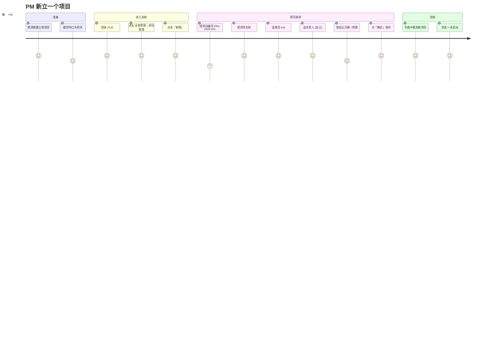
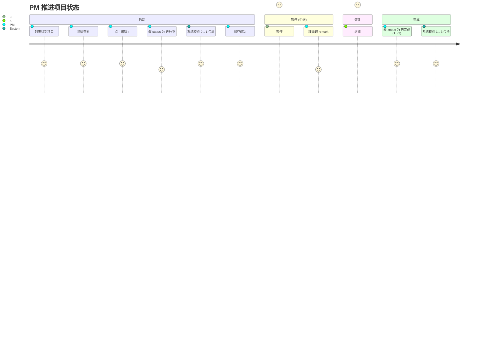
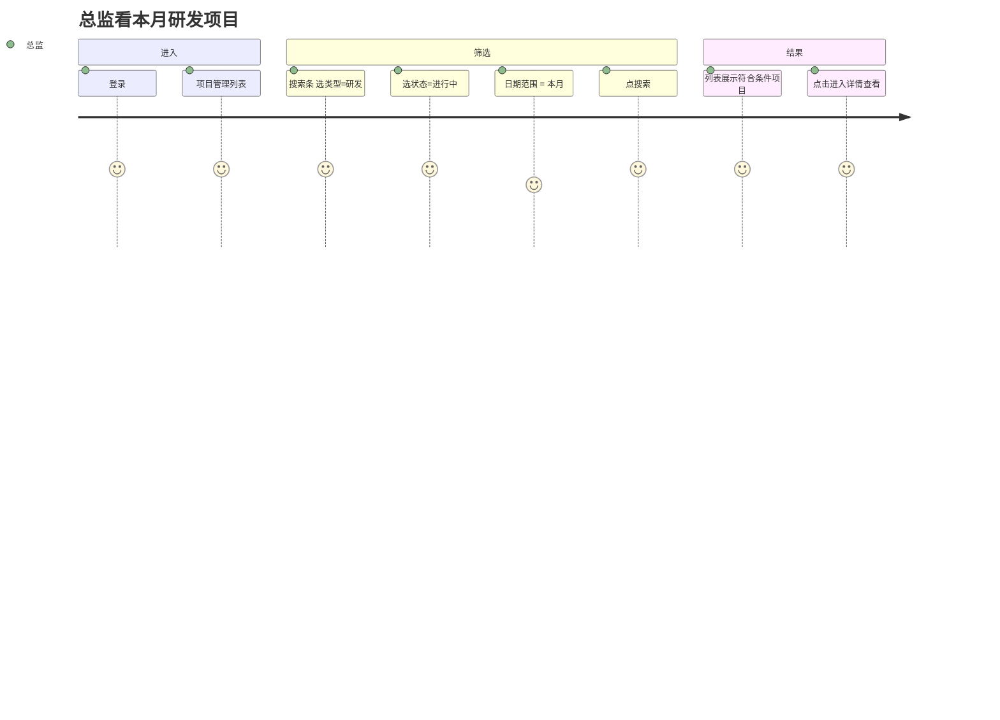
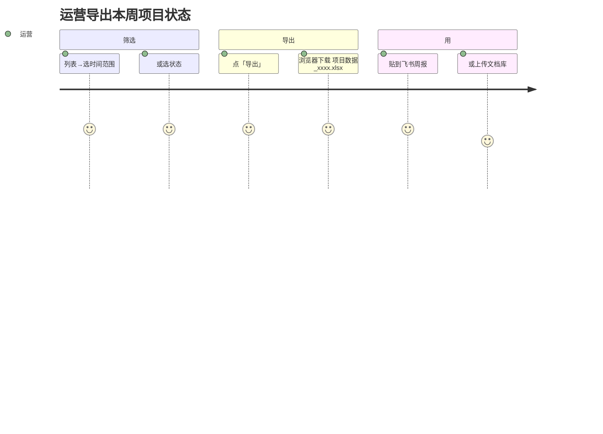

# Project 用户旅程图

关联 [Project-PRD §2.2 典型场景](../../01-立项/Project-PRD.md)。

## S1: 立项 — 从想法到落库

**痛点 → 设计响应**

| 痛点 | 响应 |
|---|---|
| 项目编号怕重号 | DB UNIQUE 索引 + 返 602 错误码（[ADR-0001](../../03-开发/ADR/0001-project-no-rule.md)） |
| 不知道选什么类型 | 字典下拉 (`biz_project_type`)，新值由 admin 维护 |
| 怕填错日期 | 起止日期可选；后端校验 start ≤ end |

---

## S2: 推进 — 项目启动到完成

**关键交互**：
- 状态机校验在**后端 Service 层强校验**（PRD Q3 决议）；前端可同时校验做 UX 优化
- 非法转换（如 3→1 "已完成回滚到进行中"）返 701 + 中文消息

---

## S3: 看板 — 总监筛选

**关键交互**：
- 搜索条参数对应 ProjectQuery 字段（projectType / status / params.begin/endStartDate）
- 默认每页 10 条；可调整 pageSize 至 20/50/100

---

## S4: 导出 — 周报准备

**关键交互**：
- 导出参数 = 当前搜索条件（不只是当前页）
- 文件名带时间戳，避免覆盖

---

## 旅程图与测试用例的对应

Phase 04 测试用例库应至少覆盖：

- TC-S1-001: 立项完整流程（含字段校验、唯一性、合法状态值）
- TC-S2-001: 状态合法转换（0→1, 1→2, 2→1, 1→3）
- TC-S2-002: 状态非法转换（3→1, 4→任意）
- TC-S3-001: 多条件组合搜索 + 分页
- TC-S4-001: 导出文件内容验证（行数 = 筛选后总数）
