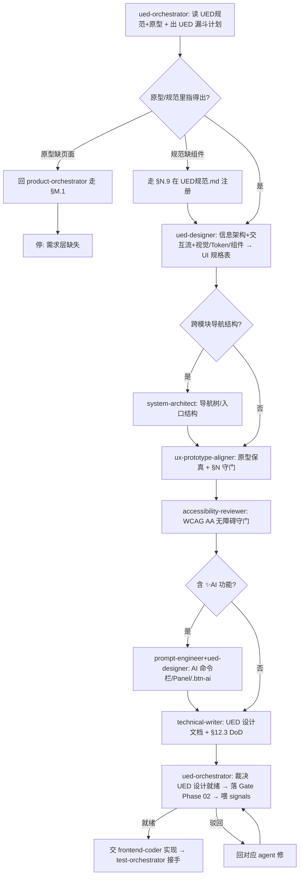

# PLM UED 设计工作流（UX/UI Design Workflow）

> 单一事实来源:写前端代码**之前**的 UI/交互设计**怎么编排、谁来做、什么算 UED 就绪、怎么自进化**。
> 配套:[`.claude/rules.md §N(UED 9 项)/§N.10(UED 设计编排)/§M.9(产品设计,上游)`](../.claude/rules.md)(硬约束) · [`ued-orchestrator` agent](../.claude/agents/ued-orchestrator.md)(UED 设计经理总管) · [`plm-ued-design` skill](../.claude/skills/plm-ued-design/SKILL.md)(SOP) · [`02-设计/UED规范.md`](../02-设计/UED规范.md)(SSoT)。
> 落地依据:proposal [0026](proposals/0026-ued-design-orchestration.md)。
> 姊妹篇:[产品设计工作流.md](产品设计工作流.md)(需求维度) · [测试工作流.md](测试工作流.md)(开发后) — 三者串成完整生命周期。

## 0. 一句话

> UED 设计不是"前端看着原型自由发挥",而是一条**从一句 UI 需求收敛到可追溯 UED 规格**的、可编排、可裁决、可自进化的漏斗。`ued-orchestrator`(用户体验设计经理)是这条线的总管,它不画原型/写 CSS/写 Vue,而是出计划、分派子 agent、收口裁决"UED 设计就绪"、把结果喂回自进化环。

## 1. UED 设计漏斗（分层与职责）

```
  ╲ 一句话 ("提测页面 UI 怎么做")                                   ╱
   ╲ U1 信息架构 ued-designer(+system-architect) 导航位置/分组/Tab   ╱  结构
    ╲ U2 交互流  ued-designer            操作路径/hover/focus/三态    ╱   │
     ╲U3 视觉/组件 ued-designer ★         Token/栅格/按钮/徽章/表单/   ╱    │
      ╲                                 表格/卡片 选自 UED规范库      ╱     ▼
       ╲U4 原型保真 ux-prototype-aligner ★ 表单label/徽章色/AI按钮↔HTML╱   收敛
        ╲U5 无障碍  accessibility-reviewer ★ WCAG AA 对比度/focus/不靠色╱    │
         ╲U6 交付   technical-writer       UED §12.3 设计交付 6 项 DoD ╱     ▼
       ═══ AI UI 旁路 ═══ prompt-engineer+ued-designer(模块含 ✨AI:命令栏/Panel/.btn-ai)
                          可开发的 UED 设计就绪规格
```

**铁律**:U3 用到的颜色/间距/组件**必须**来自 UED规范.md(Token + 附录A CSS 类);规范里没有的新组件/新颜色,**先走 §N.9 在 UED规范.md 注册再用**——不许临时造匿名颜色/裸 hex/任意间距(§N.1/N.6/N.9)。原型里指不出来的页面,回 `product-orchestrator` 走 §M.1。这是防"前端自由发挥"的核心闸门。

## 2. 端到端流程（与产品设计并行）

```
Phase 02 设计期 — 三个平级维度同时展开:
   product-orchestrator (需求维度) → 字段/状态/错误码 → PRD-MAPPING §2/§3/§4
   db-orchestrator      (数据维度) → 表/字典/索引/迁移 → schema (§M.10)
   ued-orchestrator     (UI 维度)  → 信息架构/交互/Token/组件/无障碍 → UED 规格 (本工作流)
        ↓ 三维度各自 Gate 都过
   Phase 02→03 准入(设计就绪 + schema 就绪 + UED 就绪 三者皆绿)
        ↓ 交棒
   frontend-coder / backend-coder 开发 → test-orchestrator 测试
```

### Phase 02 UED 准入(声明"UI 设计完毕/可以让前端写"时,强制)


## 3. 角色矩阵

| 角色 | agent/工具 | 职责 | 不做 |
|---|---|---|---|
| **总管** | `ued-orchestrator` | 出 UED 漏斗计划/DAG、分派、裁决 UED 设计就绪、沉淀 signals | 不画原型/写 CSS/写 Vue |
| 澄清 | `requirement-clarifier` | 模糊 UI 指令 → AskUserQuestion 选项 | 不裁决 |
| 范围 | `scope-decider` | UI 改动 P0/P1/P2 分级 | 不动手 |
| **UI 规格建模** ★ | `ued-designer` | 信息架构+交互+视觉/Token/组件,锚 UED规范+原型 | 不写 .vue/.css |
| 导航结构 | `system-architect` | 跨模块导航树/入口结构 | 不管视觉细节 |
| **原型保真** ★ | `ux-prototype-aligner` | 表单/徽章/AI 按钮 ↔ 原型,§N 守门 | 不画原型/写 Vue |
| **无障碍** ★ | `accessibility-reviewer` | WCAG AA 对比度/focus/label/不靠色 | 不管视觉风格 |
| 交付 | `technical-writer` | UED 设计文档 + §12.3 DoD | 概念未稳不写 |
| AI UI | `prompt-engineer` | AI 命令栏/Panel/prompt | — |
| 交棒 | `frontend-coder` → `test-orchestrator` | UED 就绪后实现 + 测试 | — |

★ = proposal 0026 涉及的 UED 专属子 agent(ued-designer / accessibility-reviewer 新建;ux-prototype-aligner 复用自 0024)。

## 4. UED 设计就绪 Gate 裁决标准（§N.10.3）

判"**UED 设计就绪 / 可进前端开发**"必须**同时**满足(与 product/db 维度共同构成 Phase 02→03 准入):
1. **Token 合规**:颜色全走 `var(--xx)` 无裸 hex(§N.1);间距 4px 倍数(§N.6);圆角/阴影/动效在档位
2. **组件选自库**:用 UED规范 附录A CSS 类;新类/新色已先走 §N.9 注册
3. **状态徽章正确**:状态色对 PRD-MAPPING §3 状态机(§N.2)
4. **AI 区分**:AI 触发用 `.btn-ai`✨,非 AI 禁用(§N.3)
5. **三态齐全**:空/载/错都设计了(§N.5)
6. **原型保真**:ux-prototype-aligner 确认 §N 无违规
7. **无障碍达标**:accessibility-reviewer 确认 WCAG AA(§11)
8. **设计交付 DoD**:UED规范 §12.3 的 6 项
9. **与产品设计一致**:状态/字段对 prd-author 的 PRD-MAPPING §2/§3,UI 不另起状态

任一不满足 → **驳回**,指明回哪个 agent;**禁**"先让前端写着 UED 回头补"、**禁**前端自由发挥。

## 5. 跑偏处置升级路径

```
UED 漏斗中发现"跑偏"
   ├─ 原型缺页面 → 回 product-orchestrator 走 §M.1(需求层缺失,不是 UED 能补)
   ├─ 规范缺组件/颜色 → 走 §N.9 先在 UED规范.md 注册(先改规范再写代码)
   ├─ 状态徽章色凭感觉 → 驳回,精确对 PRD-MAPPING §3(§N.2 一票否决)
   ├─ 只设计正常态 → 驳回,空/载/错是 §N.5 MUST
   └─ 无障碍不达标 → accessibility-reviewer 出违规清单 → 回 ued-designer 或 frontend-coder
        ↓ 最多 3 轮仍对不齐
   升级问 user(可能是原型本身缺页面/规范缺组件,需补原型或补规范章节)
```
**防自由发挥是硬底线**:宁可停下来注册新组件/问 user,也不让前端凭感觉造 UI(§N.1/N.9 红线)。

## 6. 自进化节律（signals → reflect → proposal）

| 节律 | 动作 | 产物 |
|---|---|---|
| 每轮 UED 设计收口 | 总管记 UED signals(token 违规/组件复用缺口/无障碍违规/三态缺失/规格滞后) | [signals UED 设计编排段](signals/README.md) |
| 周 | `/reflect-weekly` 看 UED 趋势 | reflect 报告 |
| 月 | 采集触发条件 | 见下 |
| 触发提案 | 同类 token 违规月≥3 → 加 stylelint/PreToolUse hook;a11y 反复某项 → axe-core 纳入 E2E;反复用未登记组件 → UED规范补组件章节;三态反复遗漏 → 组件模板默认带骨架 | proposals/NNNN |

**进化闭环**:UED 设计过程自己产生数据(signals)→ 反思发现模式(reflect)→ 提案改规则/工具(proposals)→ rule/workflow/skill/agent 演进 → 下一轮更省力。这就是"UED 设计过程能自己去做、自己去进化"的机制。

## 7. 一票否决项（不许跳过）

| 项 | 检查 |
|---|---|
| 先读 UED规范 + 原型 | 任何 UI 设计前必读 |
| 原型缺页面 | 停,回 §M.1,**禁**前端自由发挥 |
| 规范缺组件/颜色 | 停,§N.9 先注册再用,**禁**裸 hex/匿名色 |
| 状态徽章色可指出 | §N.2,对 PRD-MAPPING §3 |
| 三态齐全 | §N.5,空/载/错 |
| 无障碍达标 | §11,对比度/focus/label/不靠色 |
| UI 规格先于实现 commit | `ued_handoff_lag`=0 |

## 8. 与产品设计 / 测试工作流的衔接

```
产品设计就绪(产品设计工作流 §4,需求维度)  ─┐
schema 就绪(§M.10,数据维度)              ─┼─ 三维度皆绿 → Phase 02→03 准入
UED 设计就绪(本工作流 §4,UI 维度)         ─┘
        ↓ 交棒
backend-coder / frontend-coder 开发(Phase 03)
        ↓ 交棒
test-orchestrator(测试工作流接手, Phase 03→04 准入)
```
三个维度总管平级:`product-orchestrator` 保"需求对得上 PRD"、`db-orchestrator` 保"schema 设计安全"、`ued-orchestrator` 保"UI 对得上原型+规范+无障碍"。三者皆绿才交 coder。完整生命周期闭环。

## 修订记录

| 日期 | 变更 |
|---|---|
| 2026-05-27 | 首次创建:UED 设计编排自进化工作流(proposal 0026,对位 0024 产品设计 / 0025 数据库设计)|
