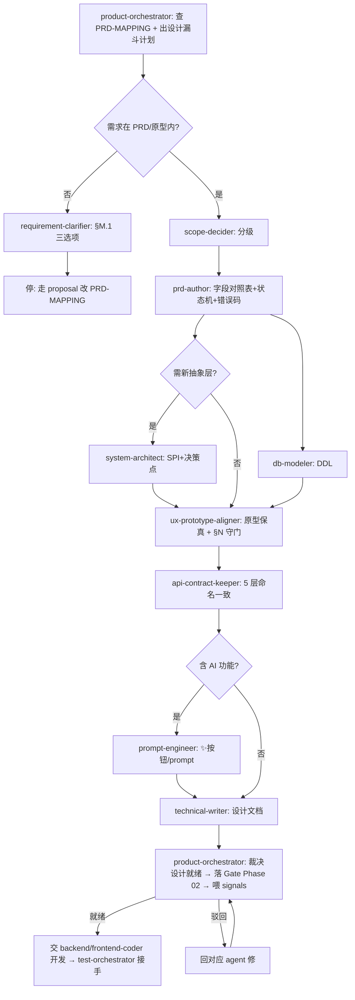

# PLM 产品设计工作流（Product Design Workflow）

> 单一事实来源:开发**之前**的产品设计**怎么编排、谁来做、什么算就绪、怎么自进化**。
> 配套:[`.claude/rules.md §M(PRD 驱动)/§M.9(产品设计编排)/§N(UED)`](../.claude/rules.md)(硬约束) · [`product-orchestrator` agent](../.claude/agents/product-orchestrator.md)(产品经理总管) · [`plm-product-design` skill](../.claude/skills/plm-product-design/SKILL.md)(SOP) · [`PRD-MAPPING.md`](../PRD-MAPPING.md)(SSoT)。
> 落地依据:proposal [0024](proposals/0024-product-design-orchestration.md)。
> 姊妹篇:[测试工作流.md](测试工作流.md)(开发**之后**) — 两者一前一后,串成完整生命周期。

## 0. 一句话

> 产品设计不是"想到哪做到哪",而是一条**从模糊想法收敛到可追溯规格**的、可编排、可裁决、可自进化的漏斗。`product-orchestrator`(产品经理)是这条线的总管,它不亲自写 PRD/画原型/写代码,而是出计划、分派子 agent、收口裁决"设计就绪"、把结果喂回自进化环。

## 1. 产品设计漏斗（分层与职责）

```
  ╲ 模糊想法 / 用户一句话 ("加个测试管理模块")                      ╱
   ╲ L1 澄清     requirement-clarifier   "全部/优化下" → 明确选项    ╱  发散
    ╲ L2 范围    scope-decider           P0/P1/P2 分级 + 推荐        ╱   │
     ╲L3 PRD建模 prd-author ★            字段对照表+状态机+错误码,    ╱   │
      ╲                                 逐项锚定 PRD §+原型元素      ╱    ▼
       ╲L4 数据/架构 db-modeler+system-architect  DDL/SPI/抽象层    ╱   收敛
        ╲L5 原型对齐 ux-prototype-aligner ★ 表单/徽章/AI按钮↔HTML  ╱     │
         ╲L6 契约   api-contract-keeper   5 层命名一致(为开发铺路) ╱      │
          ╲L7 文档   technical-writer     概念稳定后出设计 .md    ╱       ▼
       ═══ AI 旁路 ═══ prompt-engineer(模块含 ✨AI 功能时)        可开发的设计就绪规格
```

**铁律**:**字段对照表(L3)必须先于代码 commit**(§M.2);原型/PRD 里指不出来的字段/状态/错误码,**不许进 L3**——回 L1 让 user 走 §M.1,而不是"顺手补全"。这是防跑偏的核心闸门。

## 2. 端到端流程（三段）

### 段 1 — 立项/规划期(Phase 01,想法收敛)
```
用户一句模糊需求
   → requirement-clarifier 拆成明确选项(L1)
   → scope-decider 出 P0/P1/P2(L2)
   → 查 PRD-MAPPING:在 PRD 内? 否 → §M.1 三选项让 user 拍板
目标:把"想做什么"收敛到"PRD 内、已分级的明确需求"。
```

### 段 2 — 需求设计期(Phase 02,规格建模)
```
product-orchestrator 出漏斗计划:
  prd-author 建模(L3)     → 字段对照表 + 状态机 + 错误码 → PRD-MAPPING §2/§3/§4
       ↓ 字段表先 commit
  db-modeler + system-architect(L4) → DDL / 抽象层
  ux-prototype-aligner(L5) → 原型保真 + §N 守门
  api-contract-keeper(L6)  → 5 层命名一致
  technical-writer(L7)     → 设计文档
```

### 段 3 — Phase 02→03 准入(声明"设计完毕/可以开发"时,强制)


## 3. 角色矩阵

| 角色 | agent/工具 | 职责 | 不做 |
|---|---|---|---|
| **总管** | `product-orchestrator` | 出漏斗计划/DAG、分派、裁决设计就绪、沉淀 signals | 不亲自写 PRD/画原型/写码 |
| 澄清 | `requirement-clarifier` | 模糊指令 → AskUserQuestion 选项 | 不裁决 |
| 范围 | `scope-decider` | P0/P1/P2 分级 | 不动手 |
| **需求建模** ★ | `prd-author` | 字段对照表+状态机+错误码,锚 PRD-MAPPING | 不写 Domain.java/SQL |
| 数据 | `db-modeler` | DDL/字典/索引 | 不应用 SQL(db-ops 才应用) |
| 架构 | `system-architect` | SPI/门面/抽象层 + 决策点 | 不写业务码 |
| **原型对齐** ★ | `ux-prototype-aligner` | 表单/徽章/AI 按钮 ↔ 原型,§N 守门 | 不画原型/写 Vue |
| 契约 | `api-contract-keeper` | 5 层命名字段一致 | — |
| 文档 | `technical-writer` | 概念稳定后写设计 .md | 不在概念未稳时写 |
| AI | `prompt-engineer` | prompt/few-shot 设计 | — |
| 交棒 | `backend/frontend-coder` → `test-orchestrator` | 设计就绪后开发 + 测试 | — |

★ = proposal 0024 新建的产品设计专属子 agent。

## 4. 设计就绪 Gate 裁决标准（§M.9.3）

判"**设计就绪 / 可进开发**"(Phase 02→03 准入)必须**同时**满足:
1. **可追溯**:每个字段/状态/错误码/菜单文案都指得出 PRD § + 原型 HTML 元素(prd-author 矩阵无空行)
2. **字段对照表先行**:PRD-MAPPING §2 已 commit 且先于代码 commit(§M.2)
3. **状态合法**:状态只来自 PRD §3.2 / 原型徽章 CSS 类 / PRD-MAPPING §3(§M.4)
4. **错误码登记**:新错误码已登 PRD-MAPPING §4,无裸数字(§M.5)
5. **原型保真**:ux-prototype-aligner 确认 §N 无违规
6. **三者一致**:PRD/原型/MAPPING 一致,不一致已按 §M.1 走 proposal

任一不满足 → **驳回**,指明回哪个 agent;**禁**"先开发着设计回头补"、**禁**凭直觉补字段。

## 5. 跑偏处置升级路径

```
设计漏斗中发现"跑偏"
   ├─ 需求不在 PRD/原型 → §M.1 三选项让 user 拍板(按 PRD / 走 proposal 改 MAPPING / 记评审)
   ├─ 三者(PRD/原型/MAPPING)冲突 → prd-author 定位差异点 → user 拍板,不默默选一边
   ├─ 字段对照表缺失就想写码 → 驳回,先补 PRD-MAPPING §2(§M.2)
   └─ 原型保真违规(§N) → ux-prototype-aligner 出违规清单 → 回 prd-author 或 frontend-coder
        ↓ 最多 3 轮仍对不齐
   升级问 user(可能是 PRD 本身缺失,需补章节/补原型)
```
**防跑偏是硬底线**:宁可停下来问 user,也不凭直觉给 PRD 补字段/状态/错误码(§M.1 最严红线)。

## 6. 自进化节律（signals → reflect → proposal）

| 节律 | 动作 | 产物 |
|---|---|---|
| 每轮设计收口 | 总管记产品设计 signals(PRD drift/原型偏离/不可追溯字段/字段表滞后/PRD 演化走 proposal 占比) | [signals 产品设计编排段](signals/README.md) |
| 周 | `/reflect-weekly` 看设计趋势 | reflect 报告 |
| 月 | 采集触发条件 | 见下 |
| 触发提案 | 同类 PRD drift 月≥3 → PRD-MAPPING 补全提案;某类字段反复指不出原型 → 原型补画提案;§N 违规集中某子项 → UED 加 hook 提案 | proposals/NNNN |

**进化闭环**:产品设计过程自己产生数据(signals)→ 反思发现模式(reflect)→ 提案改规则/工具(proposals)→ rule/workflow/skill/agent 演进 → 下一轮更省力。这就是"产品设计过程能自己去做、自己去进化"的机制。

## 7. 一票否决项（不许跳过）

| 项 | 检查 |
|---|---|
| 先查 PRD-MAPPING | 任何业务设计前必读 |
| 需求不在 PRD/原型 | 停,走 §M.1,**禁**凭直觉补 |
| 字段对照表先于代码 commit | §M.2,字段表滞后=违规 |
| 状态来源可指出 | §M.4,无"顺手补全" |
| 错误码已登记 | §M.5,无裸数字 |
| 原型保真 §N | 状态徽章色/AI 按钮/label/三态 |

## 8. 与测试工作流的衔接

```
设计就绪(本工作流 §4 Gate 通过, Phase 02→03)
        ↓ 交棒
backend-coder / frontend-coder 开发(Phase 03)
        ↓ 交棒
test-orchestrator(测试工作流接手, Phase 03→04 准入)
```
两个总管一前一后:`product-orchestrator` 保"设计对得上 PRD"、`test-orchestrator` 保"实现测得过"。中间是 coder 开发。完整生命周期闭环。

## 修订记录

| 日期 | 变更 |
|---|---|
| 2026-05-27 | 首次创建:产品设计编排自进化工作流(proposal 0024) |
