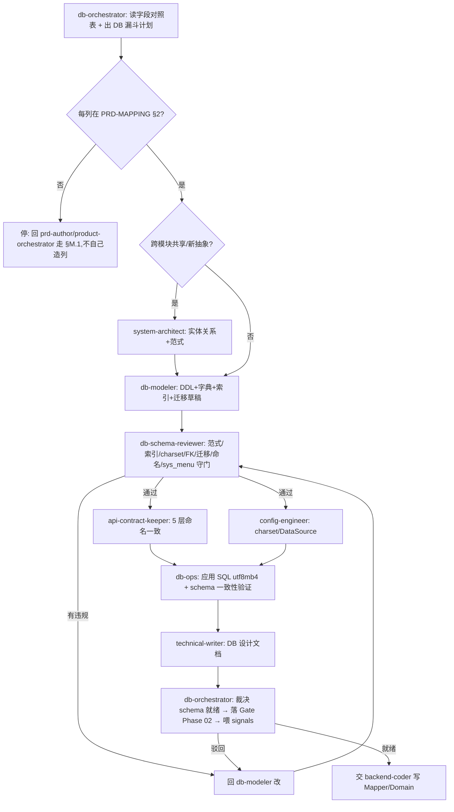

# PLM 数据库设计工作流（Database Design Workflow）

> 单一事实来源:建表**之前**的数据库设计**怎么编排、谁来做、什么算 schema 就绪、怎么自进化**。
> 配套:[`.claude/rules.md §M.10(DB 编排)/§M.2(DoD)/§M.3(命名)/§M.7(跨模块)/§A`](../.claude/rules.md)(硬约束) · [`db-orchestrator` agent](../.claude/agents/db-orchestrator.md)(总管) · [`plm-db-design` skill](../.claude/skills/plm-db-design/SKILL.md)(SOP) · [`db-modeler`](../.claude/agents/db-modeler.md)(设计) / [`db-schema-reviewer`](../.claude/agents/db-schema-reviewer.md)(守门) / [`db-ops`](../.claude/agents/db-ops.md)(应用)。
> 落地依据:proposal [0025](proposals/0025-db-design-orchestration.md)。
> 姊妹篇:[产品设计工作流.md](产品设计工作流.md)(上游,字段从哪来)、[测试工作流.md](测试工作流.md)(下游,测得过)。

## 0. 一句话

> 数据库设计不是"想到哪建到哪",而是一条**从字段对照表收敛到可建表、可应用、5 层契约一致的物理 schema**的、可编排、可裁决、可自进化的漏斗。`db-orchestrator`(数据库设计工程师)是这条线的总管,它不亲自写 DDL、不亲自 `mysql <`,而是出计划、分派子 agent、收口裁决"schema 就绪"、把结果喂回自进化环。

## 1. 数据库设计漏斗（分层与职责）

```
  字段对照表(PRD-MAPPING §2,prd-author 交付)        ← 上游(产品设计工作流)
   │ L1 字段来源   prd-author          每列对得上 PRD §+原型?指不出→停(§M.1)   发散
   │ L2 概念/逻辑  system-architect    实体关系 / 范式取舍 / 跨模块共享表          │
   │ L3 物理 DDL   db-modeler ★        tb_<entity>/类型/约束/charset utf8mb4/标配  │
   │ L4 字典       db-modeler          biz_<entity>_* + list_class 色             ▼
   │ L5 索引       db-modeler          idx_/uk_ 覆盖查询模式 + uk_<entity>_no    收敛
   │ L6 迁移       db-modeler          ALTER 幂等 + 向后兼容 + 大表锁表           │
   │ L7 评审守门   db-schema-reviewer ★ 范式/索引/charset/FK/迁移/命名/sys_menu  │
   │ L8 契约       api-contract-keeper  column↔resultMap↔domain↔DTO↔interface    │
   │ L9 应用核验   db-ops              应用 SQL(utf8mb4)+ schema 实际=期望        ▼
   ▼ 收敛为 → schema 设计就绪(可交 backend-coder 写 Mapper/Domain)
  ═══ 配置旁路 ═══ config-engineer(DataSource/JDBC/charset yml)
  ═══ 安全旁路 ═══ security-reviewer(敏感字段加密/脱敏/SQL 注入面)
```

**铁律**:字段对照表(L1,prd-author 产出)**先于** DDL;原型/PRD 里指不出来的列**不进 schema**——回 §M.1。`gotcha #2`(utf8mb4 charset)与 `gotcha #7`(business-*.sql 必含 sys_menu)是 L7 守门的**一票否决**。

## 2. 端到端流程（三段）

### 段 1 — 概念/逻辑建模(拿到字段对照表后)
```
product-orchestrator 交付字段对照表(PRD-MAPPING §2)
   → db-orchestrator 核每列来源(L1)
   → system-architect 出实体关系 + 范式取舍 + 跨模块共享表(L2)
目标:把"要存什么"收敛到"有几张表、表间关系、各表归属哪个模块"。
```

### 段 2 — 物理建模(DDL/字典/索引/迁移)
```
db-modeler:
  L3 物理 DDL  → tb_<entity> + 列类型/约束 + charset utf8mb4 + 字段标配
  L4 字典      → biz_<entity>_* (sys_dict_type/data, list_class 色)
  L5 索引      → idx_/uk_ 覆盖查询模式 + uk_<entity>_no
  L6 迁移      → ALTER 幂等(ON DUPLICATE/NOT EXISTS) + seed-*.sql 幂等
```

### 段 3 — Phase 02 数据库设计准入(声明"库设计完毕"时,强制)


## 3. 角色矩阵

| 角色 | agent/工具 | 职责 | 不做 |
|---|---|---|---|
| **总管** | `db-orchestrator` | 出漏斗计划/DAG、分派、裁决 schema 就绪、沉淀 signals | 不亲自写 DDL/应用 SQL |
| 字段来源 | `prd-author` | 列 ↔ PRD-MAPPING §2 字段对照表 | 不写 DDL(上游产物) |
| 概念/逻辑 | `system-architect` | 实体关系/范式/跨模块共享表 + 决策点 | 不写物理 DDL |
| **物理建模** ★核心 | `db-modeler` | DDL/字典/索引/迁移脚本草稿 | 不应用 SQL(db-ops) |
| **设计守门** ★ | `db-schema-reviewer` | 范式/索引/charset/FK/迁移安全/命名/sys_menu 评审 | 不写/改 DDL(回 db-modeler) |
| 契约 | `api-contract-keeper` | column↔resultMap↔domain↔DTO↔interface 5 层一致 | — |
| 配置 | `config-engineer` | DataSource/JDBC/charset yml(utf8mb4 + Redis IPv6 坑) | — |
| **应用核验** | `db-ops` | 应用 SQL(utf8mb4)+ schema 实际=期望 + dedupe/seed | 业务数据 DELETE 须问 user |
| 文档 | `technical-writer` | ER/字段表/索引/迁移说明 .md | — |
| 安全 | `security-reviewer` | 敏感字段加密/脱敏/注入面预审 | — |
| 交棒 | `backend-coder` → `test-orchestrator` | schema 就绪后写 Mapper/Domain + 测试 | — |

★ = db-modeler/db-ops 既有(设计/运维分工),db-schema-reviewer 是 proposal 0025 新建的设计守门。

## 4. schema 设计就绪 Gate 裁决标准（§M.10.3）

判"**schema 就绪 / 可建表可应用**"必须**同时**满足:
1. **可追溯**:每列对得上 PRD-MAPPING §2 字段对照表(无凭空多出的列)
2. **命名合规**:tb_/<entity>_id/<entity>_no/idx_/uk_/biz_;§M.7 跨模块同名(project_id/sprint_id/author_user_id/ai_generated/del_flag),无 creator_id 漂移(§M.3)
3. **charset 合规**:utf8mb4 + 字段长度够(gotcha #2);字段标配齐(status/author_user_id/create_*/del_flag/remark)
4. **索引充分**:覆盖主要查询模式 + uk_<entity>_no
5. **迁移安全**:幂等(ON DUPLICATE/NOT EXISTS)+ 向后兼容 + 大表锁表评估
6. **sys_menu**:business-*.sql 含 INSERT(gotcha #7)或 @no-menu 豁免
7. **契约一致**:api-contract-keeper 确认 5 层
8. **应用核验**:db-ops 确认 DB 实际 schema = sql 期望

任一不满足 → **驳回**,指明回 db-modeler/api-contract-keeper/db-ops;**禁**"先建着回头补"、**禁**自己造列、**禁**放过非 utf8mb4。

## 5. 失败升级路径

```
db-schema-reviewer / db-ops 发现问题
   ├─ 列指不出 PRD       → 回 prd-author/product-orchestrator 走 §M.1(需求问题,非设计)
   ├─ charset 非 utf8mb4 → P0(gotcha #2 复发),立即回 db-ops/config-engineer 修,不放过
   ├─ 命名漂移(§M.7)    → 回 db-modeler 对齐现有规约
   ├─ 迁移不安全         → 回 db-modeler 改幂等 + 评估锁表窗口
   ├─ 缺 sys_menu(#7)   → 回 db-modeler 补 INSERT 或加 @no-menu 豁免
   └─ schema 不一致      → db-ops 定位差集 → 重跑对应 business-*.sql
        ↓ 最多 3 轮仍不齐
   升级问 user(可能是字段对照表本身缺,需回产品设计漏斗)
```
**防跑偏 + 防乱码是硬底线**:charset 与 sys_menu 一票否决,绝不"先建着回头改"。

## 6. 自进化节律（signals → reflect → proposal）

| 节律 | 动作 | 产物 |
|---|---|---|
| 每轮库设计收口 | 总管记 DB signals(命名漂移/索引缺口/charset 违规/迁移不安全/缺 sys_menu/schema 漂移) | [signals 数据库设计编排段](signals/README.md) |
| 周 | `/reflect-weekly` 看库设计趋势 | reflect 报告 |
| 月 | 采集触发条件 | 见下 |
| 触发提案 | charset_violation > 0 → P0 复盘(gotcha #2);naming_drift 月≥3 → §M.7 强化/加 lint hook;index_gap 集中 → 补索引 checklist;missing_sys_menu 反复 → 查是否 --no-verify 绕过 | proposals/NNNN |

**进化闭环**:库设计过程自己产生数据(signals)→ 反思发现模式(reflect)→ 提案改规则/工具(proposals)→ rule/workflow/skill/agent 演进 → 下一轮更省力。这就是"数据库设计过程能自己去做、自己去进化"的机制。

## 7. 一票否决项（不许跳过）

| 项 | 检查 |
|---|---|
| 先查 PRD-MAPPING §2 | 任何建表/加字段前必读 |
| 列不在字段对照表 | 停,回 §M.1,**禁**自己造列 |
| charset = utf8mb4 | gotcha #2,非 utf8mb4 = P0 阻塞 |
| business-*.sql 含 sys_menu | gotcha #7,缺 = 前端不可达(pre-commit hook 拦) |
| 字段标配齐 | status/author_user_id/del_flag... |
| 跨模块同名 | §M.7,creator_id vs author_user_id 必须统一 |
| 迁移幂等 + 大表锁表 | 非幂等/裸 ALTER 大表 = 阻塞 |

## 8. 与上下游工作流的衔接

```
产品设计就绪(产品设计工作流, Phase 02 前段, prd-author 出字段对照表)
        ↓ 交棒(字段对照表 = DB 设计输入)
schema 设计就绪(本工作流 §4 Gate, Phase 02 后段)
        ↓ 交棒
backend-coder 写 Mapper/Domain(Phase 03)
        ↓ 交棒
test-orchestrator(测试工作流, Phase 03→04 准入)
```
三个总管串成生命周期链:`product-orchestrator`(字段从哪来)→ `db-orchestrator`(schema 怎么落地)→ `test-orchestrator`(实现测得过)。中间是 coder 开发。

## 修订记录

| 日期 | 变更 |
|---|---|
| 2026-05-27 | 首次创建:数据库设计编排自进化工作流(proposal 0025) |
