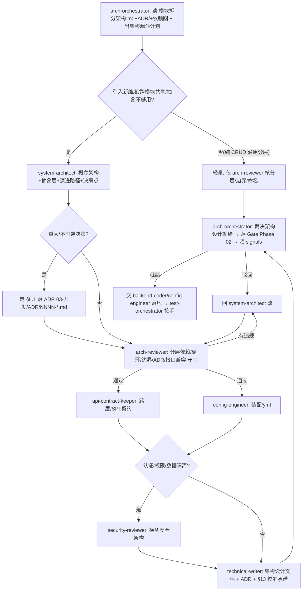

# PLM 系统架构设计工作流（System Architecture Design Workflow）

> 单一事实来源:写代码**之前**的系统架构设计**怎么编排、谁来做、什么算架构就绪、怎么自进化**。
> 配套:[`.claude/rules.md §Q(架构设计编排)/§A(分层/命名)/§L.1(ADR 触发)`](../.claude/rules.md)(硬约束) · [`arch-orchestrator` agent](../.claude/agents/arch-orchestrator.md)(架构师总管) · [`plm-arch-design` skill](../.claude/skills/plm-arch-design/SKILL.md)(SOP) · [`03-开发/模块拆分架构.md`](../03-开发/模块拆分架构.md) + [`03-开发/ADR/`](../03-开发/ADR/)(SSoT)。
> 落地依据:proposal [0027](proposals/0027-architecture-design-orchestration.md)。
> 姊妹篇:[产品设计工作流.md](产品设计工作流.md)(需求维度) · [数据库设计工作流.md](数据库设计工作流.md)(数据维度) · [UED设计工作流.md](UED设计工作流.md)(UI 维度) · [测试工作流.md](测试工作流.md)(开发后) — 五者串成完整生命周期。

## 0. 一句话

> 架构设计不是"写代码时随手分个层、需要时临时加个接口",而是一条**从一句架构需求收敛到分层合规、边界清晰、抽象适度、可演进的架构设计**的、可编排、可裁决、可自进化的漏斗。`arch-orchestrator`(架构师)是这条线的总管,它不写 Service/装配 Bean/画最终落地类图,而是出计划、分派子 agent、收口裁决"架构设计就绪"、把结果喂回自进化环。

## 1. 架构设计漏斗（分层与职责）

```
  ╲ 一句话 ("这能力的架构怎么设计")                                   ╱
   ╲ A1 架构驱动力 scope-decider+system-architect 质量属性/约束/新维度 ╱  结构
    ╲ A2 概念架构  system-architect ★         C4 Context/Container/边界  ╱   │
     ╲A3 抽象层设计 system-architect ★          门面/SPI/Provider/可选注入 ╱    │
      ╲A4 演进路径  system-architect            兼容性表/V1→V2→V3/迁移     ╱     ▼
       ╲A5 架构评审 arch-reviewer ★             分层依赖方向/循环/边界/ADR ╱   收敛
        ╲A6 契约    api-contract-keeper         跨层/SPI 接口一致          ╱     │
         ╲A7 装配   config-engineer             Bean/AutoConfiguration/yml ╱     ▼
          ╲A8 交付  technical-writer            架构设计.md + ADR + §13 校准╱
       ═══ 安全旁路 ═══ security-reviewer(认证/权限/数据隔离/横切安全架构)
       ═══ 数据旁路 ═══ db-modeler(架构含新表/共享表,转 db-orchestrator)
       ═══ AI 旁路  ═══ prompt-engineer(AI Provider/门面路由架构)
                          可落地的架构设计就绪规格
```

**铁律**:依赖方向**单向**(`plm-admin → plm-framework → plm-system → plm-common`,见 CLAUDE.md "Architecture" + [模块拆分架构.md](../03-开发/模块拆分架构.md)),**禁循环依赖与反向 import**;跨模块共享走 **SPI/接口反向依赖**(common 定接口,下游实现);**重大/不可逆决策必须落 ADR**(§L.1);抽象**适度**(1 实现不上 SPI / N 实现不硬编码 if-else)。这是防"地基塌方"(循环依赖)与"过度/欠设计"的核心闸门。

## 2. 端到端流程（与产品/数据库/UED 并行）

```
Phase 02 设计期 — 四个平级维度同时展开:
   product-orchestrator (需求维度) → 字段/状态/错误码 → PRD-MAPPING §2/§3/§4
   db-orchestrator      (数据维度) → 表/字典/索引/迁移 → schema (§M.10)
   ued-orchestrator     (UI 维度)  → 信息架构/交互/Token/组件/无障碍 → UED 规格 (§N.10)
   arch-orchestrator    (架构维度) → 分层/边界/抽象/演进/ADR → 架构设计 (本工作流, §Q)
        ↓ 四维度各自 Gate 都过
   Phase 02→03 准入(设计就绪 + schema 就绪 + UED 就绪 + 架构就绪 四者皆绿)
        ↓ 交棒
   backend-coder / frontend-coder / config-engineer 开发 → test-orchestrator 测试
```

### Phase 02 架构准入(声明"架构设计完毕/可以让后端写"时,强制)


## 3. 角色矩阵

| 角色 | agent/工具 | 职责 | 不做 |
|---|---|---|---|
| **总管** | `arch-orchestrator` | 出架构漏斗计划/DAG、分派、裁决架构设计就绪、沉淀 signals | 不写 Service/装配 Bean/画最终类图 |
| 澄清 | `requirement-clarifier` | 模糊架构指令 → AskUserQuestion 选项 | 不裁决 |
| 范围 | `scope-decider` | 架构改动 P0/P1/P2 分级 + 驱动力 | 不动手 |
| **架构建模** ★ | `system-architect` | 概念架构+抽象层+演进路径,门面/SPI/可选注入/兼容性表/决策点 | 不写实现代码 |
| **架构评审** ★ | `arch-reviewer` | 分层依赖方向/循环/边界/ADR 完整/接口兼容/§13 校准 | 不改设计,只守门 |
| 契约 | `api-contract-keeper` | 跨层/SPI 接口 interface↔impl↔调用方 一致 | 不管架构整体质量 |
| 装配 | `config-engineer` | Bean/AutoConfiguration/yml `${VAR:default}` 占位 | 不管抽象选型 |
| 数据 | `db-modeler`(转 db-orchestrator) | 架构含新表/共享表 | — |
| 安全 | `security-reviewer` | 认证/权限/数据隔离/横切安全架构 | — |
| 交付 | `technical-writer` | 架构设计文档 + ADR + §13 落地校准 | 概念未稳不写 |
| AI 架构 | `prompt-engineer` | AI Provider/门面路由 + prompt | — |
| 交棒 | `backend-coder`/`config-engineer` → `test-orchestrator` | 架构就绪后落地 + 测试 | — |

★ = proposal 0027 涉及的架构专属角色(arch-reviewer 新建;system-architect 复用为核心建模者,即架构维度的"建模者",对位 prd-author/db-modeler/ued-designer)。

## 4. 架构设计就绪 Gate 裁决标准（§Q.3）

判"**架构设计就绪 / 可进开发**"必须**同时**满足(与 product/db/ued 维度共同构成 Phase 02→03 准入):
1. **分层合规**:依赖方向单向(admin→framework→system→common),无循环依赖/反向 import;业务在 system.business.<entity>、Controller 在 plm-admin/web/controller/business(§A)
2. **边界清晰**:模块职责单一;跨模块共享走 SPI/接口反向依赖(common 定接口下游实现)
3. **抽象适度**:不过度(1 实现不上门面/SPI)+ 不欠设计(N 实现不硬编码 if-else);符合 system-architect 三模式
4. **演进可追溯**:重大/不可逆决策有 ADR(03-开发/ADR/,§L.1);有兼容性表/演进路径
5. **接口稳定**:公开 API 向后兼容;破坏性变更有迁移说明 + 兼容性表
6. **决策点收尾**:草案给 user 1-3 个决策点(system-architect §12)
7. **落地校准承诺**:头部标状态 + 约定落地后补 §13"草案 vs 实际"(system-architect §13)
8. **配置外置 + 装配合理**:secret 走 `${VAR:default}`(§C);横切独立事务/AutoConfiguration
9. **安全合规**:涉认证/权限/数据隔离经 security-reviewer(涉密时)

任一不满足 → **驳回**,指明回哪个 agent;**禁**"先开发着架构回头补"、**禁**放过循环依赖/反向 import。

## 5. 跑偏处置升级路径

```
架构漏斗中发现"跑偏"
   ├─ 循环依赖/反向 import → P0,回 system-architect 用 SPI/接口反向依赖重构(地基红线,不"先这么写")
   ├─ 重大决策无 ADR → 停,先走 §L.1 落 03-开发/ADR/NNNN-*.md(决策"为什么"必须留痕)
   ├─ 过度设计(1 实现上 SPI) → 驳回,YAGNI,砍到够用
   ├─ 欠设计(N 实现硬编码 if-else) → 驳回,上 SPI/Provider 路由
   ├─ 破坏性接口变更无兼容说明 → 驳回,出兼容性表 + 迁移路径
   └─ 草案与落地长期偏离 → 提醒补 §13 落地校准
        ↓ 最多 3 轮仍对不齐
   升级问 user(可能需求层缺维度,回 product-orchestrator;或选型分歧需 user 拍 ADR)
```
**防地基塌方是硬底线**:循环依赖/反向 import 是 P0,宁可停下来用 SPI 重构,也不让"先跑着回头改"——分层塌了全塌。

## 6. 自进化节律（signals → reflect → proposal）

| 节律 | 动作 | 产物 |
|---|---|---|
| 每轮架构设计收口 | 总管记架构 signals(分层违规/边界越界/抽象失配/缺 ADR/接口破坏/校准滞后) | [signals 架构设计编排段](signals/README.md) |
| 周 | `/reflect-weekly` 看架构趋势 | reflect 报告 |
| 月 | 采集触发条件 | 见下 |
| 触发提案 | `layering_violation_count` > 0 → **P0 复盘** + 加 ArchUnit/依赖检查 hook;`missing_adr_count` 反复 → ADR 模板/commit 关联强化;`abstraction_fit_gap` 集中过度设计 → YAGNI checklist;`interface_break_count` > 0 → 接口版本化 + 兼容性测试纳入 CI | proposals/NNNN |

**进化闭环**:架构设计过程自己产生数据(signals)→ 反思发现模式(reflect)→ 提案改规则/工具(proposals)→ rule/workflow/skill/agent 演进 → 下一轮更省力。这就是"架构设计过程能自己去做、自己去进化"的机制。

## 7. 一票否决项（不许跳过）

| 项 | 检查 |
|---|---|
| 先读 模块拆分架构 + ADR + 依赖图 | 任何架构设计前必读 |
| 无循环依赖/反向 import | §Q.3.1,P0 地基红线 |
| 重大决策有 ADR | §L.1,决策"为什么"必须留痕 |
| 抽象适度 | 不过度(1 实现不上 SPI)+ 不欠(N 实现不硬编码) |
| 接口向后兼容 | 破坏性变更有兼容性表 + 迁移说明 |
| 架构设计/ADR 先于实现 commit | `arch_calibration_lag` 不倒挂 |

## 8. 与产品/数据库/UED/测试工作流的衔接

```
产品设计就绪(产品设计工作流 §4,需求维度)  ─┐
schema 就绪(§M.10,数据维度)              ─┤
UED 设计就绪(UED设计工作流 §4,UI 维度)     ─┼─ 四维度皆绿 → Phase 02→03 准入
架构设计就绪(本工作流 §4,架构维度)         ─┘
        ↓ 交棒
backend-coder / frontend-coder / config-engineer 开发(Phase 03)
        ↓ 交棒
test-orchestrator(测试工作流接手, Phase 03→04 准入)
```
四个维度总管平级:`product-orchestrator` 保"需求对得上 PRD"、`db-orchestrator` 保"schema 设计安全"、`ued-orchestrator` 保"UI 对得上原型+规范+无障碍"、`arch-orchestrator` 保"架构分层合规、抽象适度、可演进"。四者皆绿才交 coder。完整生命周期闭环。

> 注:很多 Phase 02 任务只需 product/db/ued 三维度(纯 CRUD 沿用现有分层);**架构维度仅在"引入新维度/跨模块共享/抽象层不够用/改公开接口/重大选型"时强制全漏斗**,纯 CRUD 走 §5/Pattern B 轻量路径(仅 arch-reviewer 核分层+命名)。避免每个小模块都摆架构 DAG(反模式)。

## 修订记录

| 日期 | 变更 |
|---|---|
| 2026-05-27 | 首次创建:系统架构设计编排自进化工作流(proposal 0027,对位 0024 产品 / 0025 数据库 / 0026 UED,Phase 02 第四个设计维度)|
