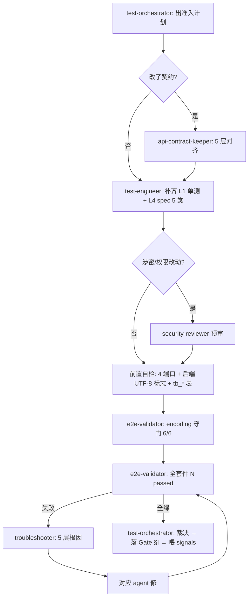

# PLM 测试工作流（Test Workflow）

> 单一事实来源:开发过程中**测试怎么编排、谁来做、什么算过、怎么自进化**。
> 配套:[`.claude/rules.md §G.4/§G.5`](../.claude/rules.md)(硬约束) · [`test-orchestrator` agent](../.claude/agents/test-orchestrator.md)(编排总管) · [`plm-test-orchestrate` skill](../.claude/skills/plm-test-orchestrate/SKILL.md)(SOP) · [`plm-e2e` skill](../.claude/skills/plm-e2e/SKILL.md)(E2E 执行)。
> 落地依据:proposal [0023](proposals/0023-test-orchestration-self-evolution.md)。

## 0. 一句话

> 测试不是"开发完再补"的一锤子,而是一条**贯穿开发期的、可编排、可裁决、可自进化**的流水线。`test-orchestrator` 是这条线的总管,它不亲自动手,而是出计划、分派 5 个子 agent、收口裁决、把结果喂回自进化环。

## 1. 测试金字塔（分层与职责）

```
        ╱╲          L4 E2E (Playwright)          ← e2e-validator 跑 / test-engineer 写
       ╱  ╲         慢、贵、像真用户;准入强制
      ╱────╲        L3 契约 (5 层命名对齐)        ← api-contract-keeper
     ╱      ╲       interface↔domain↔column↔DTO↔resultMap
    ╱────────╲      L2 组件 (Vitest + MSW)        ← test-engineer
   ╱          ╲     前端组合式逻辑 / store / 工具
  ╱────────────╲    L1 单元 (JUnit5 + Mockito)    ← test-engineer
 ╱──────────────╲   后端 ServiceImpl 分支/状态机/校验;快、多
  ═══ 守门 ═══     encoding.spec 6 case (一票否决)  ← e2e-validator
```

**铁律**:能用 L1 单测覆盖的逻辑分支,**不要**推到 L4 E2E(金字塔倒挂 = 慢且脆)。E2E 只测"端到端真能跑通 + 编码 + UI 可达"。

## 2. 端到端流程（三段）

### 段 1 — 开发期 TDD 环(写代码时,持续)
```
backend-coder/frontend-coder 改 ServiceImpl/组件
   → test-engineer 同步补 L1 单测(正/负/边界, @Nested 分簇)
   → 改了契约? → api-contract-keeper 校 5 层一致
   → 本地 mvn test / vitest 自验
```
目标:逻辑分支在最便宜的层就被覆盖,不积压到准入。

### 段 2 — Pre-merge 定向回归(提交前)
```
test-orchestrator 判范围(scope-decider 协助):
  改 typo/非业务      → e2e-validator: smoke (~15s)
  改某模块字段/状态机  → e2e-validator: <module> + encoding → 全套件
  改 yml encoding/JDBC → e2e-validator: encoding 守门(P0)
```

### 段 3 — Phase 03→04 准入(声明"开发完毕"时,强制)


## 3. 角色矩阵

| 角色 | agent/工具 | 职责 | 不做 |
|---|---|---|---|
| **总管** | `test-orchestrator` | 出计划/DAG、分派、裁决、沉淀 signals | 不亲自写/跑 |
| 写测试 | `test-engineer` | L1 单测 + L2 组件测 + L4 spec | 不裁决 Gate |
| 契约 | `api-contract-keeper` | 5 层命名字段一致 | — |
| 跑回归 | `e2e-validator` | 跑全套 + flake vs 真退步分类 | 不写 spec |
| 排障 | `troubleshooter` | E2E/构建失败 5 层根因 | 不改业务码(交回对应 agent) |
| 安全 | `security-reviewer` | 涉密/权限/注入/XSS 预审 | — |
| 构建 | `build-deployer` | stale JVM → kill+install+重启 | — |
| 收口 | `progress-narrator` / `git-workflow` | 出汇总 / 证据落档 commit | — |

## 4. Gate 裁决标准（§G.5.3）

判"**通过**"必须**同时**满足:
1. encoding 守门 6/6 且 DB 全字段 HEX 无 `EFBFBD`(一票否决)
2. 全套件 `N passed`,**0 fail / 0 did-not-run**(flake 经 `--retries=1` 复测仍绿)
3. 新模块覆盖 5 类:CRUD + 状态机合法/非法 + FK + 编码 HEX + UI 可达
4. 契约改动经 api-contract-keeper 确认 5 层一致
5. 证据为**本轮真实输出**,已落进对应 `gate-checklists/instances/<module>/Phase03-开发-Gate-*.md` §I

任一不满足 → **驳回**,指明回哪个 agent;**禁**"再跑一次试试"、**禁**贴历史证据。

## 5. 失败升级路径

```
e2e-validator fail
   ├─ <5 个 → 逐个 flake 分类(login timeout / 加载系统资源 / 表不存在 / stale JVM / seed 缺失)
   └─ ≥5 个 → 系统性问题 → troubleshooter 先定位环境(schema/服务/JVM)
        ↓ 锁定根因
   对应 agent 修(db-ops / backend-coder / build-deployer / api-contract-keeper)
        ↓
   build-deployer 重建(如需) → 回 e2e-validator
        ↓ 最多 3 轮
   仍不绿 → 升级问 user(不无限重试)
```
**不退步是硬底线**:非本次改动职责的 fail(如 stale env)也要先修环境再裁决,不放过、不写注释绕过。

## 6. 自进化节律（signals → reflect → proposal）

| 节律 | 动作 | 产物 |
|---|---|---|
| 每轮测试收口 | 总管记测试 signals(flake/真退步/覆盖缺口/RCA 分类/证据回填企图) | [signals §8](signals/README.md) |
| 周 | `/reflect-weekly` 看测试趋势 | reflect 报告 |
| 月 | 采集触发条件 | 见下 |
| 触发提案 | 同类 flake 月≥3 → 稳定性提案;覆盖缺口反复 → 补模板提案;守门连续 N 轮 0 问题 → 守门降频实验 | proposals/NNNN |

**进化闭环**:测试过程自己产生数据(signals)→ 反思发现模式(reflect)→ 提案改规则/工具(proposals)→ rule/workflow/skill/agent 演进 → 下一轮更省力。这就是"测试过程能自己去做、自己去进化"的机制。

## 7. 一票否决项（不许跳过）

| 项 | 检查 |
|---|---|
| 编码守门 | `npm run test:e2e:encoding` 6/6 |
| 后端 4 个 UTF-8 标志 | `ps -ef \| grep file.encoding` |
| DB charset | `SELECT @@character_set_database;` = `utf8mb4` |
| 任何字段 HEX 含 `EFBFBD` | P0 阻塞,立即停 |
| flake 与真退步混淆 | 必须分开记 signals |

## 修订记录

| 日期 | 变更 |
|---|---|
| 2026-05-27 | 首次创建:测试编排自进化工作流(proposal 0023) |
